# Bassan.os Database ERD v2.0

## Document Control
- **Document Title**: Bassan.os Database Entity-Relationship Diagram
- **Version**: 2.0
- **Status**: Ready for Implementation
- **Date**: 2024-01-20
- **Author**: Senior Database Architect
- **Linked Documents**: BRD v2.0, User Stories Catalog v2.0, Technical Architecture v2.0

---

## SECTION 1: DATABASE ARCHITECTURE OVERVIEW

### 1.1 Multi-Tenant Strategy
Bassan.os implements a **schema-per-tenant** pattern for complete data isolation while maintaining operational efficiency.

**Schema Structure**:
```
bassanos_public (shared schema for platform metadata)
  ├─ tenant (tenant registry)
  ├─ user (global user registry)
  └─ platform_config (platform settings)

bassanos_tenant_{tenant_id} (tenant-specific schema)
  ├─ organization (organization structure)
  ├─ department (departments)
  ├─ employee (employee records)
  ├─ customer (customer data)
  ├─ workflow (workflow definitions)
  ├─ task (task records)
  ├─ commission (commission data)
  └─ ... (domain-specific tables)
```

### 1.2 Naming Conventions
- **Tables**: snake_case, plural (e.g., users, departments)
- **Columns**: snake_case (e.g., user_id, created_at)
- **Primary Keys**: {table}_id (e.g., user_id, task_id)
- **Foreign Keys**: {referenced_table}_id (e.g., user_id, department_id)
- **Timestamps**: created_at, updated_at (TIMESTAMP WITH TIME ZONE)
- **Soft Deletes**: deleted_at (TIMESTAMP WITH TIME ZONE, NULL if not deleted)

### 1.3 Data Types
- **Primary Keys**: UUID (for all main entities)
- **Foreign Keys**: UUID (referencing primary keys)
- **Names**: VARCHAR(255)
- **Descriptions**: TEXT
- **Emails**: VARCHAR(255)
- **Phone Numbers**: VARCHAR(20)
- **Monetary Values**: DECIMAL(19,4)
- **Percentages**: DECIMAL(5,2)
- **Status Fields**: VARCHAR(50) (ENUM-like with check constraints)
- **Timestamps**: TIMESTAMP WITH TIME ZONE
- **Booleans**: BOOLEAN
- **JSON Data**: JSONB (for flexible schema requirements)

---

## SECTION 2: ENTITY & ATTRIBUTE TABLE

### 2.1 Platform & Tenant Management

#### tenant
| Column | Type | Constraints | Description |
|--------|------|-------------|-------------|
| tenant_id | UUID | PK, NOT NULL | Unique tenant identifier |
| tenant_code | VARCHAR(50) | UNIQUE, NOT NULL | Human-readable tenant code |
| tenant_name | VARCHAR(255) | NOT NULL | Tenant name |
| tenant_type | VARCHAR(50) | NOT NULL | Tenant type (TRIAL, STANDARD, ENTERPRISE) |
| status | VARCHAR(50) | NOT NULL, DEFAULT 'ACTIVE' | Tenant status (ACTIVE, SUSPENDED, TERMINATED) |
| subscription_plan_id | UUID | FK | Subscription plan reference |
| max_users | INTEGER | NOT NULL, DEFAULT 10 | Maximum users allowed |
| max_departments | INTEGER | NOT NULL, DEFAULT 5 | Maximum departments allowed |
| max_storage_gb | INTEGER | NOT NULL, DEFAULT 10 | Maximum storage in GB |
| billing_cycle_start_day | INTEGER | NOT NULL, DEFAULT 1 | Day of month billing starts |
| timezone | VARCHAR(50) | NOT NULL, DEFAULT 'UTC' | Tenant timezone |
| locale | VARCHAR(10) | NOT NULL, DEFAULT 'en_US' | Tenant locale |
| logo_url | VARCHAR(500) | NULL | Tenant logo URL |
| custom_domain | VARCHAR(255) | UNIQUE, NULL | Custom domain for tenant |
| settings | JSONB | NOT NULL, DEFAULT '{}' | Tenant-specific settings |
| created_at | TIMESTAMP WITH TIME ZONE | NOT NULL, DEFAULT NOW() | Record creation timestamp |
| updated_at | TIMESTAMP WITH TIME ZONE | NOT NULL, DEFAULT NOW() | Last update timestamp |
| deleted_at | TIMESTAMP WITH TIME ZONE | NULL | Soft delete timestamp |

**Indexes**:
- PRIMARY KEY (tenant_id)
- UNIQUE INDEX (tenant_code)
- INDEX (status)
- INDEX (subscription_plan_id)

#### user
| Column | Type | Constraints | Description |
|--------|------|-------------|-------------|
| user_id | UUID | PK, NOT NULL | Unique user identifier |
| tenant_id | UUID | FK, NOT NULL | Tenant reference |
| user_code | VARCHAR(50) | NOT NULL | Human-readable user code |
| email | VARCHAR(255) | NOT NULL | User email |
| password_hash | VARCHAR(255) | NOT NULL | Hashed password |
| first_name | VARCHAR(100) | NOT NULL | First name |
| last_name | VARCHAR(100) | NOT NULL | Last name |
| display_name | VARCHAR(255) | NULL | Display name (if different from full name) |
| phone | VARCHAR(20) | NULL | Phone number |
| avatar_url | VARCHAR(500) | NULL | Profile picture URL |
| status | VARCHAR(50) | NOT NULL, DEFAULT 'ACTIVE' | User status (ACTIVE, INACTIVE, SUSPENDED) |
| user_type | VARCHAR(50) | NOT NULL | User type (INTERNAL, EXTERNAL, PARTNER, FREELANCER, CUSTOMER) |
| mfa_enabled | BOOLEAN | NOT NULL, DEFAULT FALSE | Multi-factor authentication enabled |
| mfa_secret | VARCHAR(255) | NULL | MFA secret for TOTP |
| mfa_backup_codes | JSONB | NULL | Backup codes for MFA |
| last_login_at | TIMESTAMP WITH TIME ZONE | NULL | Last successful login timestamp |
| last_password_change_at | TIMESTAMP WITH TIME ZONE | NULL | Last password change timestamp |
| password_reset_token | VARCHAR(255) | NULL | Password reset token |
| password_reset_expires_at | TIMESTAMP WITH TIME ZONE | NULL | Password reset token expiration |
| email_verified | BOOLEAN | NOT NULL, DEFAULT FALSE | Email verification status |
| email_verification_token | VARCHAR(255) | NULL | Email verification token |
| settings | JSONB | NOT NULL, DEFAULT '{}' | User-specific settings |
| created_at | TIMESTAMP WITH TIME ZONE | NOT NULL, DEFAULT NOW() | Record creation timestamp |
| updated_at | TIMESTAMP WITH TIME ZONE | NOT NULL, DEFAULT NOW() | Last update timestamp |
| deleted_at | TIMESTAMP WITH TIME ZONE | NULL | Soft delete timestamp |

**Indexes**:
- PRIMARY KEY (user_id)
- UNIQUE INDEX (tenant_id, email)
- INDEX (tenant_id, user_code)
- INDEX (status)
- INDEX (user_type)
- INDEX (email_verification_token)
- INDEX (password_reset_token)

#### role
| Column | Type | Constraints | Description |
|--------|------|-------------|-------------|
| role_id | UUID | PK, NOT NULL | Unique role identifier |
| tenant_id | UUID | FK, NOT NULL | Tenant reference |
| role_code | VARCHAR(50) | NOT NULL | Human-readable role code |
| role_name | VARCHAR(255) | NOT NULL | Role name |
| role_type | VARCHAR(50) | NOT NULL | Role type (SYSTEM, CUSTOM, DEPARTMENT) |
| description | TEXT | NULL | Role description |
| is_system_role | BOOLEAN | NOT NULL, DEFAULT FALSE | System role flag (cannot be deleted) |
| permissions | JSONB | NOT NULL, DEFAULT '[]' | Role permissions array |
| created_at | TIMESTAMP WITH TIME ZONE | NOT NULL, DEFAULT NOW() | Record creation timestamp |
| updated_at | TIMESTAMP WITH TIME ZONE | NOT NULL, DEFAULT NOW() | Last update timestamp |
| deleted_at | TIMESTAMP WITH TIME ZONE | NULL | Soft delete timestamp |

**Indexes**:
- PRIMARY KEY (role_id)
- UNIQUE INDEX (tenant_id, role_code)
- INDEX (role_type)
- INDEX (is_system_role)

#### user_role
| Column | Type | Constraints | Description |
|--------|------|-------------|-------------|
| user_role_id | UUID | PK, NOT NULL | Unique user role assignment identifier |
| user_id | UUID | FK, NOT NULL | User reference |
| role_id | UUID | FK, NOT NULL | Role reference |
| assigned_by | UUID | FK | User who assigned this role |
| assigned_at | TIMESTAMP WITH TIME ZONE | NOT NULL, DEFAULT NOW() | Assignment timestamp |
| expires_at | TIMESTAMP WITH TIME ZONE | NULL | Role expiration timestamp |
| is_primary | BOOLEAN | NOT NULL, DEFAULT FALSE | Primary role flag |

**Indexes**:
- PRIMARY KEY (user_role_id)
- UNIQUE INDEX (user_id, role_id)
- INDEX (role_id)
- INDEX (expires_at)

---

### 2.2 Organization & Department Structure

#### organization
| Column | Type | Constraints | Description |
|--------|------|-------------|-------------|
| organization_id | UUID | PK, NOT NULL | Unique organization identifier |
| tenant_id | UUID | FK, NOT NULL | Tenant reference |
| org_code | VARCHAR(50) | NOT NULL | Human-readable organization code |
| org_name | VARCHAR(255) | NOT NULL | Organization name |
| org_type | VARCHAR(50) | NOT NULL | Organization type (HEADQUARTERS, BRANCH, SUBSIDIARY) |
| parent_org_id | UUID | FK | Parent organization reference |
| address | JSONB | NULL | Address information |
| contact_info | JSONB | NULL | Contact information |
| status | VARCHAR(50) | NOT NULL, DEFAULT 'ACTIVE' | Organization status (ACTIVE, INACTIVE) |
| settings | JSONB | NOT NULL, DEFAULT '{}' | Organization-specific settings |
| created_at | TIMESTAMP WITH TIME ZONE | NOT NULL, DEFAULT NOW() | Record creation timestamp |
| updated_at | TIMESTAMP WITH TIME ZONE | NOT NULL, DEFAULT NOW() | Last update timestamp |
| deleted_at | TIMESTAMP WITH TIME ZONE | NULL | Soft delete timestamp |

**Indexes**:
- PRIMARY KEY (organization_id)
- UNIQUE INDEX (tenant_id, org_code)
- INDEX (parent_org_id)
- INDEX (status)

#### department
| Column | Type | Constraints | Description |
|--------|------|-------------|-------------|
| department_id | UUID | PK, NOT NULL | Unique department identifier |
| tenant_id | UUID | FK, NOT NULL | Tenant reference |
| organization_id | UUID | FK, NOT NULL | Organization reference |
| dept_code | VARCHAR(50) | NOT NULL | Human-readable department code |
| dept_name | VARCHAR(255) | NOT NULL | Department name |
| parent_dept_id | UUID | FK | Parent department reference |
| manager_id | UUID | FK | Department manager reference |
| description | TEXT | NULL | Department description |
| status | VARCHAR(50) | NOT NULL, DEFAULT 'ACTIVE' | Department status (ACTIVE, INACTIVE) |
| budget_allocation | DECIMAL(19,4) | NULL | Budget allocation |
| settings | JSONB | NOT NULL, DEFAULT '{}' | Department-specific settings |
| created_at | TIMESTAMP WITH TIME ZONE | NOT NULL, DEFAULT NOW() | Record creation timestamp |
| updated_at | TIMESTAMP WITH TIME ZONE | NOT NULL, DEFAULT NOW() | Last update timestamp |
| deleted_at | TIMESTAMP WITH TIME ZONE | NULL | Soft delete timestamp |

**Indexes**:
- PRIMARY KEY (department_id)
- UNIQUE INDEX (tenant_id, organization_id, dept_code)
- INDEX (organization_id)
- INDEX (parent_dept_id)
- INDEX (manager_id)
- INDEX (status)

#### employee
| Column | Type | Constraints | Description |
|--------|------|-------------|-------------|
| employee_id | UUID | PK, NOT NULL | Unique employee identifier |
| tenant_id | UUID | FK, NOT NULL | Tenant reference |
| user_id | UUID | FK, NOT NULL | User reference |
| organization_id | UUID | FK, NOT NULL | Organization reference |
| employee_code | VARCHAR(50) | NOT NULL | Human-readable employee code |
| job_title | VARCHAR(255) | NULL | Job title |
| employment_type | VARCHAR(50) | NOT NULL | Employment type (FULL_TIME, PART_TIME, CONTRACTOR, FREELANCER) |
| hire_date | DATE | NOT NULL | Hire date |
| termination_date | DATE | NULL | Termination date |
| department_id | UUID | FK | Primary department reference |
| manager_id | UUID | FK | Direct manager reference |
| status | VARCHAR(50) | NOT NULL, DEFAULT 'ACTIVE' | Employee status (ACTIVE, ON_LEAVE, TERMINATED) |
| salary | DECIMAL(19,4) | NULL | Salary |
| hourly_rate | DECIMAL(19,4) | NULL | Hourly rate |
| cost_center | VARCHAR(50) | NULL | Cost center code |
| skills | JSONB | NOT NULL, DEFAULT '[]' | Employee skills array |
| performance_rating | DECIMAL(5,2) | NULL | Performance rating |
| last_review_date | DATE | NULL | Last performance review date |
| settings | JSONB | NOT NULL, DEFAULT '{}' | Employee-specific settings |
| created_at | TIMESTAMP WITH TIME ZONE | NOT NULL, DEFAULT NOW() | Record creation timestamp |
| updated_at | TIMESTAMP WITH TIME ZONE | NOT NULL, DEFAULT NOW() | Last update timestamp |
| deleted_at | TIMESTAMP WITH TIME ZONE | NULL | Soft delete timestamp |

**Indexes**:
- PRIMARY KEY (employee_id)
- UNIQUE INDEX (tenant_id, employee_code)
- UNIQUE INDEX (user_id)
- INDEX (organization_id)
- INDEX (department_id)
- INDEX (manager_id)
- INDEX (status)
- INDEX (employment_type)

---

### 2.3 Customer Management

#### customer
| Column | Type | Constraints | Description |
|--------|------|-------------|-------------|
| customer_id | UUID | PK, NOT NULL | Unique customer identifier |
| tenant_id | UUID | FK, NOT NULL | Tenant reference |
| customer_code | VARCHAR(50) | NOT NULL | Human-readable customer code |
| customer_type | VARCHAR(50) | NOT NULL | Customer type (INDIVIDUAL, BUSINESS, GOVERNMENT) |
| customer_name | VARCHAR(255) | NOT NULL | Customer name |
| contact_name | VARCHAR(255) | NULL | Primary contact name |
| email | VARCHAR(255) | NULL | Email address |
| phone | VARCHAR(20) | NULL | Phone number |
| address | JSONB | NULL | Address information |
| billing_address | JSONB | NULL | Billing address (if different) |
| customer_tier | VARCHAR(50) | NOT NULL, DEFAULT 'STANDARD' | Customer tier (STANDARD, PREMIUM, ENTERPRISE) |
| customer_status | VARCHAR(50) | NOT NULL, DEFAULT 'ACTIVE' | Customer status (ACTIVE, INACTIVE, CHURNED) |
| credit_limit | DECIMAL(19,4) | NULL | Credit limit |
| payment_terms | VARCHAR(50) | NULL | Payment terms |
| assigned_sales_rep_id | UUID | FK | Assigned sales representative |
| assigned_account_manager_id | UUID | FK | Assigned account manager |
| lead_source | VARCHAR(50) | NULL | Lead source (REFERRAL, WEBSITE, CAMPAIGN, PARTNER) |
| first_contact_date | DATE | NULL | First contact date |
| last_contact_date | DATE | NULL | Last contact date |
| total_revenue | DECIMAL(19,4) | NOT NULL, DEFAULT 0 | Total revenue from customer |
| settings | JSONB | NOT NULL, DEFAULT '{}' | Customer-specific settings |
| created_at | TIMESTAMP WITH TIME ZONE | NOT NULL, DEFAULT NOW() | Record creation timestamp |
| updated_at | TIMESTAMP WITH TIME ZONE | NOT NULL, DEFAULT NOW() | Last update timestamp |
| deleted_at | TIMESTAMP WITH TIME ZONE | NULL | Soft delete timestamp |

**Indexes**:
- PRIMARY KEY (customer_id)
- UNIQUE INDEX (tenant_id, customer_code)
- INDEX (customer_type)
- INDEX (customer_status)
- INDEX (customer_tier)
- INDEX (assigned_sales_rep_id)
- INDEX (assigned_account_manager_id)
- INDEX (lead_source)
- INDEX (email)

#### customer_contact
| Column | Type | Constraints | Description |
|--------|------|-------------|-------------|
| contact_id | UUID | PK, NOT NULL | Unique contact identifier |
| customer_id | UUID | FK, NOT NULL | Customer reference |
| tenant_id | UUID | FK, NOT NULL | Tenant reference |
| contact_name | VARCHAR(255) | NOT NULL | Contact name |
| contact_type | VARCHAR(50) | NOT NULL | Contact type (PRIMARY, BILLING, TECHNICAL, OPERATIONAL) |
| email | VARCHAR(255) | NULL | Email address |
| phone | VARCHAR(20) | NULL | Phone number |
| title | VARCHAR(100) | NULL | Job title |
| department | VARCHAR(255) | NULL | Department |
| is_primary | BOOLEAN | NOT NULL, DEFAULT FALSE | Primary contact flag |
| preferred_contact_method | VARCHAR(50) | NULL | Preferred contact method (EMAIL, PHONE, SMS) |
| settings | JSONB | NOT NULL, DEFAULT '{}' | Contact-specific settings |
| created_at | TIMESTAMP WITH TIME ZONE | NOT NULL, DEFAULT NOW() | Record creation timestamp |
| updated_at | TIMESTAMP WITH TIME ZONE | NOT NULL, DEFAULT NOW() | Last update timestamp |
| deleted_at | TIMESTAMP WITH TIME ZONE | NULL | Soft delete timestamp |

**Indexes**:
- PRIMARY KEY (contact_id)
- INDEX (customer_id)
- INDEX (contact_type)
- INDEX (is_primary)
- INDEX (email)

---

### 2.4 Workflow & Task Management

#### workflow
| Column | Type | Constraints | Description |
|--------|------|-------------|-------------|
| workflow_id | UUID | PK, NOT NULL | Unique workflow identifier |
| tenant_id | UUID | FK, NOT NULL | Tenant reference |
| workflow_code | VARCHAR(50) | NOT NULL | Human-readable workflow code |
| workflow_name | VARCHAR(255) | NOT NULL | Workflow name |
| workflow_type | VARCHAR(50) | NOT NULL | Workflow type (BUSINESS_PROCESS, APPROVAL, ESCALATION) |
| category | VARCHAR(50) | NOT NULL | Workflow category |
| description | TEXT | NULL | Workflow description |
| version | VARCHAR(20) | NOT NULL, DEFAULT '1.0' | Workflow version |
| status | VARCHAR(50) | NOT NULL, DEFAULT 'DRAFT' | Workflow status (DRAFT, ACTIVE, ARCHIVED) |
| trigger_type | VARCHAR(50) | NOT NULL | Trigger type (MANUAL, EVENT, SCHEDULED) |
| trigger_event | VARCHAR(255) | NULL | Event type that triggers workflow |
| trigger_conditions | JSONB | NOT NULL, DEFAULT '[]' | Trigger conditions array |
| workflow_definition | JSONB | NOT NULL | Workflow definition (states, transitions, actions) |
| sla_threshold_minutes | INTEGER | NULL | SLA threshold in minutes |
| sla_breach_action | VARCHAR(50) | NULL | SLA breach action (NOTIFY, ESCALATE, TERMINATE) |
| owner_id | UUID | FK | Workflow owner |
| created_by | UUID | FK | User who created workflow |
| created_at | TIMESTAMP WITH TIME ZONE | NOT NULL, DEFAULT NOW() | Record creation timestamp |
| updated_at | TIMESTAMP WITH TIME ZONE | NOT NULL, DEFAULT NOW() | Last update timestamp |
| activated_at | TIMESTAMP WITH TIME ZONE | NULL | Activation timestamp |
| deactivated_at | TIMESTAMP WITH TIME ZONE | NULL | Deactivation timestamp |
| deleted_at | TIMESTAMP WITH TIME ZONE | NULL | Soft delete timestamp |

**Indexes**:
- PRIMARY KEY (workflow_id)
- UNIQUE INDEX (tenant_id, workflow_code, version)
- INDEX (workflow_type)
- INDEX (category)
- INDEX (status)
- INDEX (trigger_type)
- INDEX (owner_id)

#### task
| Column | Type | Constraints | Description |
|--------|------|-------------|-------------|
| task_id | UUID | PK, NOT NULL | Unique task identifier |
| tenant_id | UUID | FK, NOT NULL | Tenant reference |
| task_code | VARCHAR(50) | NOT NULL | Human-readable task code |
| task_name | VARCHAR(255) | NOT NULL | Task name |
| task_type | VARCHAR(50) | NOT NULL | Task type (MANUAL, AUTOMATIC, APPROVAL) |
| description | TEXT | NULL | Task description |
| status | VARCHAR(50) | NOT NULL, DEFAULT 'PENDING' | Task status (PENDING, IN_PROGRESS, COMPLETED, CANCELLED) |
| priority | VARCHAR(50) | NOT NULL, DEFAULT 'MEDIUM' | Task priority (LOW, MEDIUM, HIGH, CRITICAL) |
| workflow_id | UUID | FK | Workflow reference |
| workflow_instance_id | UUID | FK | Workflow instance reference |
| parent_task_id | UUID | FK | Parent task reference |
| assigned_to | UUID | FK | Assigned user reference |
| assigned_by | UUID | FK | User who assigned task |
| assigned_at | TIMESTAMP WITH TIME ZONE | NULL | Assignment timestamp |
| due_date | TIMESTAMP WITH TIME ZONE | NULL | Due date |
| started_at | TIMESTAMP WITH TIME ZONE | NULL | Start timestamp |
| completed_at | TIMESTAMP WITH TIME ZONE | NULL | Completion timestamp |
| estimated_hours | DECIMAL(5,2) | NULL | Estimated hours |
| actual_hours | DECIMAL(5,2) | NULL | Actual hours spent |
| evidence_required | BOOLEAN | NOT NULL, DEFAULT FALSE | Evidence required flag |
| evidence_submitted | BOOLEAN | NOT NULL, DEFAULT FALSE | Evidence submitted flag |
| evidence_files | JSONB | NOT NULL, DEFAULT '[]' | Evidence files array |
| customer_id | UUID | FK | Customer reference |
| department_id | UUID | FK | Department reference |
| tags | JSONB | NOT NULL, DEFAULT '[]' | Task tags array |
| custom_fields | JSONB | NOT NULL, DEFAULT '{}' | Custom fields for task |
| created_by | UUID | FK | User who created task |
| created_at | TIMESTAMP WITH TIME ZONE | NOT NULL, DEFAULT NOW() | Record creation timestamp |
| updated_at | TIMESTAMP WITH TIME ZONE | NOT NULL, DEFAULT NOW() | Last update timestamp |
| deleted_at | TIMESTAMP WITH TIME ZONE | NULL | Soft delete timestamp |

**Indexes**:
- PRIMARY KEY (task_id)
- UNIQUE INDEX (tenant_id, task_code)
- INDEX (status)
- INDEX (priority)
- INDEX (workflow_id)
- INDEX (workflow_instance_id)
- INDEX (parent_task_id)
- INDEX (assigned_to)
- INDEX (due_date)
- INDEX (customer_id)
- INDEX (department_id)
- INDEX (tags) (GIN index for JSONB)

#### task_dependency
| Column | Type | Constraints | Description |
|--------|------|-------------|-------------|
| dependency_id | UUID | PK, NOT NULL | Unique dependency identifier |
| task_id | UUID | FK, NOT NULL | Task reference |
| depends_on_task_id | UUID | FK, NOT NULL | Task this depends on |
| dependency_type | VARCHAR(50) | NOT NULL | Dependency type (FINISH_TO_START, START_TO_START, FINISH_TO_FINISH, START_TO_FINISH) |
| created_at | TIMESTAMP WITH TIME ZONE | NOT NULL, DEFAULT NOW() | Record creation timestamp |

**Indexes**:
- PRIMARY KEY (dependency_id)
- INDEX (task_id)
- INDEX (depends_on_task_id)
- UNIQUE INDEX (task_id, depends_on_task_id)

---

### 2.5 Sales & Pipeline

#### lead
| Column | Type | Constraints | Description |
|--------|------|-------------|-------------|
| lead_id | UUID | PK, NOT NULL | Unique lead identifier |
| tenant_id | UUID | FK, NOT NULL | Tenant reference |
| lead_code | VARCHAR(50) | NOT NULL | Human-readable lead code |
| customer_id | UUID | FK | Customer reference (if converted) |
| contact_name | VARCHAR(255) | NOT NULL | Contact name |
| company_name | VARCHAR(255) | NULL | Company name |
| email | VARCHAR(255) | NULL | Email address |
| phone | VARCHAR(20) | NULL | Phone number |
| lead_source | VARCHAR(50) | NOT NULL | Lead source (REFERRAL, WEBSITE, CAMPAIGN, PARTNER, COLD_CALL) |
| lead_source_detail | VARCHAR(255) | NULL | Lead source detail (campaign name, partner name, etc.) |
| lead_status | VARCHAR(50) | NOT NULL, DEFAULT 'NEW' | Lead status (NEW, CONTACTED, QUALIFIED, PROPOSAL, NEGOTIATION, WON, LOST) |
| pipeline_stage_id | UUID | FK | Pipeline stage reference |
| assigned_to | UUID | FK | Assigned sales representative |
| estimated_value | DECIMAL(19,4) | NULL | Estimated deal value |
| probability | DECIMAL(5,2) | NULL | Probability of closing (0-100) |
| expected_close_date | DATE | NULL | Expected close date |
| actual_close_date | DATE | NULL | Actual close date |
| lost_reason | VARCHAR(255) | NULL | Lost reason (if lost) |
| conversion_date | DATE | NULL | Conversion date (if won) |
| next_action | VARCHAR(255) | NULL | Next action |
| next_action_date | DATE | NULL | Next action date |
| tags | JSONB | NOT NULL, DEFAULT '[]' | Lead tags array |
| custom_fields | JSONB | NOT NULL, DEFAULT '{}' | Custom fields for lead |
| created_by | UUID | FK | User who created lead |
| created_at | TIMESTAMP WITH TIME ZONE | NOT NULL, DEFAULT NOW() | Record creation timestamp |
| updated_at | TIMESTAMP WITH TIME ZONE | NOT NULL, DEFAULT NOW() | Last update timestamp |
| deleted_at | TIMESTAMP WITH TIME ZONE | NULL | Soft delete timestamp |

**Indexes**:
- PRIMARY KEY (lead_id)
- UNIQUE INDEX (tenant_id, lead_code)
- INDEX (customer_id)
- INDEX (lead_status)
- INDEX (pipeline_stage_id)
- INDEX (assigned_to)
- INDEX (expected_close_date)
- INDEX (tags) (GIN index for JSONB)

#### pipeline_stage
| Column | Type | Constraints | Description |
|--------|------|-------------|-------------|
| stage_id | UUID | PK, NOT NULL | Unique stage identifier |
| tenant_id | UUID | FK, NOT NULL | Tenant reference |
| stage_code | VARCHAR(50) | NOT NULL | Human-readable stage code |
| stage_name | VARCHAR(255) | NOT NULL | Stage name |
| stage_order | INTEGER | NOT NULL | Stage order in pipeline |
| probability | DECIMAL(5,2) | NULL | Default probability for this stage |
| duration_days | INTEGER | NULL | Expected duration in days |
| is_active | BOOLEAN | NOT NULL, DEFAULT TRUE | Active stage flag |
| created_at | TIMESTAMP WITH TIME ZONE | NOT NULL, DEFAULT NOW() | Record creation timestamp |
| updated_at | TIMESTAMP WITH TIME ZONE | NOT NULL, DEFAULT NOW() | Last update timestamp |
| deleted_at | TIMESTAMP WITH TIME ZONE | NULL | Soft delete timestamp |

**Indexes**:
- PRIMARY KEY (stage_id)
- UNIQUE INDEX (tenant_id, stage_code)
- INDEX (stage_order)
- INDEX (is_active)

#### opportunity
| Column | Type | Constraints | Description |
|--------|------|-------------|-------------|
| opportunity_id | UUID | PK, NOT NULL | Unique opportunity identifier |
| tenant_id | UUID | FK, NOT NULL | Tenant reference |
| lead_id | UUID | FK | Lead reference |
| opportunity_code | VARCHAR(50) | NOT NULL | Human-readable opportunity code |
| opportunity_name | VARCHAR(255) | NOT NULL | Opportunity name |
| customer_id | UUID | FK | Customer reference |
| assigned_to | UUID | FK | Assigned sales representative |
| opportunity_stage | VARCHAR(50) | NOT NULL | Opportunity stage (QUALIFICATION, PROPOSAL, NEGOTIATION, CLOSED_WON, CLOSED_LOST) |
| value | DECIMAL(19,4) | NOT NULL | Opportunity value |
| currency | VARCHAR(3) | NOT NULL, DEFAULT 'USD' | Currency code |
| probability | DECIMAL(5,2) | NULL | Probability of closing (0-100) |
| expected_close_date | DATE | NULL | Expected close date |
| actual_close_date | DATE | NULL | Actual close date |
| close_reason | VARCHAR(255) | NULL | Close reason |
| description | TEXT | NULL | Opportunity description |
| competitor | VARCHAR(255) | NULL | Main competitor |
| next_step | VARCHAR(255) | NULL | Next step |
| tags | JSONB | NOT NULL, DEFAULT '[]' | Opportunity tags array |
| custom_fields | JSONB | NOT NULL, DEFAULT '{}' | Custom fields for opportunity |
| created_by | UUID | FK | User who created opportunity |
| created_at | TIMESTAMP WITH TIME ZONE | NOT NULL, DEFAULT NOW() | Record creation timestamp |
| updated_at | TIMESTAMP WITH TIME ZONE | NOT NULL, DEFAULT NOW() | Last update timestamp |
| deleted_at | TIMESTAMP WITH TIME ZONE | NULL | Soft delete timestamp |

**Indexes**:
- PRIMARY KEY (opportunity_id)
- UNIQUE INDEX (tenant_id, opportunity_code)
- INDEX (lead_id)
- INDEX (customer_id)
- INDEX (assigned_to)
- INDEX (opportunity_stage)
- INDEX (expected_close_date)
- INDEX (tags) (GIN index for JSONB)

---

### 2.6 Commission Management

#### commission_rule
| Column | Type | Constraints | Description |
|--------|------|-------------|-------------|
| rule_id | UUID | PK, NOT NULL | Unique rule identifier |
| tenant_id | UUID | FK, NOT NULL | Tenant reference |
| rule_code | VARCHAR(50) | NOT NULL | Human-readable rule code |
| rule_name | VARCHAR(255) | NOT NULL | Rule name |
| rule_type | VARCHAR(50) | NOT NULL | Rule type (PERCENTAGE, FIXED, TIERED, HYBRID) |
| description | TEXT | NULL | Rule description |
| commission_basis | VARCHAR(50) | NOT NULL | Commission basis (DEAL_VALUE, PROFIT, MARGIN, REVENUE) |
| rate | DECIMAL(5,2) | NULL | Commission rate (for percentage rules) |
| fixed_amount | DECIMAL(19,4) | NULL | Fixed amount (for fixed rules) |
| tier_rules | JSONB | NOT NULL, DEFAULT '[]' | Tier rules array (for tiered rules) |
| conditions | JSONB | NOT NULL, DEFAULT '[]' | Rule conditions array |
| effective_from | DATE | NOT NULL | Effective start date |
| effective_to | DATE | NULL | Effective end date |
| status | VARCHAR(50) | NOT NULL, DEFAULT 'ACTIVE' | Rule status (ACTIVE, INACTIVE, ARCHIVED) |
| applies_to | VARCHAR(50) | NOT NULL | Who rule applies to (ALL, DEPARTMENT, ROLE, INDIVIDUAL) |
| applies_to_value | VARCHAR(255) | NULL | Value for applies_to field |
| created_by | UUID | FK | User who created rule |
| created_at | TIMESTAMP WITH TIME ZONE | NOT NULL, DEFAULT NOW() | Record creation timestamp |
| updated_at | TIMESTAMP WITH TIME ZONE | NOT NULL, DEFAULT NOW() | Last update timestamp |
| deleted_at | TIMESTAMP WITH TIME ZONE | NULL | Soft delete timestamp |

**Indexes**:
- PRIMARY KEY (rule_id)
- UNIQUE INDEX (tenant_id, rule_code)
- INDEX (rule_type)
- INDEX (status)
- INDEX (effective_from, effective_to)

#### commission_calculation
| Column | Type | Constraints | Description |
|--------|------|-------------|-------------|
| calculation_id | UUID | PK, NOT NULL | Unique calculation identifier |
| tenant_id | UUID | FK, NOT NULL | Tenant reference |
| calculation_code | VARCHAR(50) | NOT NULL | Human-readable calculation code |
| rule_id | UUID | FK | Commission rule reference |
| employee_id | UUID | FK | Employee reference |
| opportunity_id | UUID | FK | Opportunity reference |
| task_id | UUID | FK | Task reference |
| calculation_date | DATE | NOT NULL | Calculation date |
| period_start | DATE | NOT NULL | Period start date |
| period_end | DATE | NOT NULL | Period end date |
| basis_amount | DECIMAL(19,4) | NOT NULL | Basis amount for calculation |
| commission_rate | DECIMAL(5,2) | NOT NULL | Commission rate applied |
| commission_amount | DECIMAL(19,4) | NOT NULL | Calculated commission amount |
| currency | VARCHAR(3) | NOT NULL, DEFAULT 'USD' | Currency code |
| status | VARCHAR(50) | NOT NULL, DEFAULT 'PENDING' | Calculation status (PENDING, APPROVED, PAID, DISPUTED) |
| approved_by | UUID | FK | User who approved calculation |
| approved_at | TIMESTAMP WITH TIME ZONE | NULL | Approval timestamp |
| paid_date | DATE | NULL | Payment date |
| payment_reference | VARCHAR(255) | NULL | Payment reference |
| dispute_reason | TEXT | NULL | Dispute reason (if disputed) |
| dispute_evidence | JSONB | NOT NULL, DEFAULT '[]' | Dispute evidence array |
| resolved_by | UUID | FK | User who resolved dispute |
| resolved_at | TIMESTAMP WITH TIME ZONE | NULL | Resolution timestamp |
| notes | TEXT | NULL | Calculation notes |
| created_at | TIMESTAMP WITH TIME ZONE | NOT NULL, DEFAULT NOW() | Record creation timestamp |
| updated_at | TIMESTAMP WITH TIME ZONE | NOT NULL, DEFAULT NOW() | Last update timestamp |
| deleted_at | TIMESTAMP WITH TIME ZONE | NULL | Soft delete timestamp |

**Indexes**:
- PRIMARY KEY (calculation_id)
- UNIQUE INDEX (tenant_id, calculation_code)
- INDEX (rule_id)
- INDEX (employee_id)
- INDEX (opportunity_id)
- INDEX (task_id)
- INDEX (calculation_date)
- INDEX (status)
- INDEX (paid_date)

---

### 2.7 Marketing & Campaigns

#### campaign
| Column | Type | Constraints | Description |
|--------|------|-------------|-------------|
| campaign_id | UUID | PK, NOT NULL | Unique campaign identifier |
| tenant_id | UUID | FK, NOT NULL | Tenant reference |
| campaign_code | VARCHAR(50) | NOT NULL | Human-readable campaign code |
| campaign_name | VARCHAR(255) | NOT NULL | Campaign name |
| campaign_type | VARCHAR(50) | NOT NULL | Campaign type (EMAIL, SOCIAL_MEDIA, PPC, CONTENT, EVENT) |
| description | TEXT | NULL | Campaign description |
| start_date | DATE | NOT NULL | Campaign start date |
| end_date | DATE | NULL | Campaign end date |
| budget | DECIMAL(19,4) | NOT NULL | Campaign budget |
| actual_spend | DECIMAL(19,4) | NOT NULL, DEFAULT 0 | Actual spend to date |
| currency | VARCHAR(3) | NOT NULL, DEFAULT 'USD' | Currency code |
| status | VARCHAR(50) | NOT NULL, DEFAULT 'PLANNED' | Campaign status (PLANNED, ACTIVE, PAUSED, COMPLETED, CANCELLED) |
| target_audience | JSONB | NOT NULL, DEFAULT '{}' | Target audience definition |
| goals | JSONB | NOT NULL, DEFAULT '[]' | Campaign goals array |
| owner_id | UUID | FK | Campaign owner |
| created_by | UUID | FK | User who created campaign |
| created_at | TIMESTAMP WITH TIME ZONE | NOT NULL, DEFAULT NOW() | Record creation timestamp |
| updated_at | TIMESTAMP WITH TIME ZONE | NOT NULL, DEFAULT NOW() | Last update timestamp |
| deleted_at | TIMESTAMP WITH TIME ZONE | NULL | Soft delete timestamp |

**Indexes**:
- PRIMARY KEY (campaign_id)
- UNIQUE INDEX (tenant_id, campaign_code)
- INDEX (campaign_type)
- INDEX (status)
- INDEX (start_date, end_date)
- INDEX (owner_id)

#### campaign_channel
| Column | Type | Constraints | Description |
|--------|------|-------------|-------------|
| channel_id | UUID | PK, NOT NULL | Unique channel identifier |
| tenant_id | UUID | FK, NOT NULL | Tenant reference |
| campaign_id | UUID | FK, NOT NULL | Campaign reference |
| channel_type | VARCHAR(50) | NOT NULL | Channel type (FACEBOOK, GOOGLE, LINKEDIN, EMAIL, SMS, WEBSITE) |
| channel_name | VARCHAR(255) | NOT NULL | Channel name |
| channel_config | JSONB | NOT NULL, DEFAULT '{}' | Channel configuration |
| budget | DECIMAL(19,4) | NOT NULL | Channel budget |
| actual_spend | DECIMAL(19,4) | NOT NULL, DEFAULT 0 | Actual spend to date |
| status | VARCHAR(50) | NOT NULL, DEFAULT 'ACTIVE' | Channel status (ACTIVE, PAUSED, COMPLETED) |
| start_date | DATE | NOT NULL | Channel start date |
| end_date | DATE | NULL | Channel end date |
| created_at | TIMESTAMP WITH TIME ZONE | NOT NULL, DEFAULT NOW() | Record creation timestamp |
| updated_at | TIMESTAMP WITH TIME ZONE | NOT NULL, DEFAULT NOW() | Last update timestamp |
| deleted_at | TIMESTAMP WITH TIME ZONE | NULL | Soft delete timestamp |

**Indexes**:
- PRIMARY KEY (channel_id)
- INDEX (campaign_id)
- INDEX (channel_type)
- INDEX (status)
- INDEX (start_date, end_date)

#### lead_attribution
| Column | Type | Constraints | Description |
|--------|------|-------------|-------------|
| attribution_id | UUID | PK, NOT NULL | Unique attribution identifier |
| tenant_id | UUID | FK, NOT NULL | Tenant reference |
| lead_id | UUID | FK, NOT NULL | Lead reference |
| campaign_id | UUID | FK | Campaign reference |
| channel_id | UUID | FK | Channel reference |
| attribution_type | VARCHAR(50) | NOT NULL | Attribution type (FIRST_TOUCH, LAST_TOUCH, MULTI_TOUCH) |
| touchpoint_date | TIMESTAMP WITH TIME ZONE | NOT NULL | Touchpoint date |
| attribution_value | DECIMAL(5,2) | NOT NULL | Attribution value (0-100) |
| is_converted | BOOLEAN | NOT NULL, DEFAULT FALSE | Conversion flag |
| conversion_date | DATE | NULL | Conversion date |
| conversion_value | DECIMAL(19,4) | NULL | Conversion value |
| created_at | TIMESTAMP WITH TIME ZONE | NOT NULL, DEFAULT NOW() | Record creation timestamp |
| updated_at | TIMESTAMP WITH TIME ZONE | NOT NULL, DEFAULT NOW() | Last update timestamp |

**Indexes**:
- PRIMARY KEY (attribution_id)
- INDEX (lead_id)
- INDEX (campaign_id)
- INDEX (channel_id)
- INDEX (touchpoint_date)
- INDEX (is_converted)
- INDEX (conversion_date)

---

### 2.8 Billing & Invoicing

#### invoice
| Column | Type | Constraints | Description |
|--------|------|-------------|-------------|
| invoice_id | UUID | PK, NOT NULL | Unique invoice identifier |
| tenant_id | UUID | FK, NOT NULL | Tenant reference |
| invoice_number | VARCHAR(50) | NOT NULL | Invoice number |
| customer_id | UUID | FK | Customer reference |
| invoice_date | DATE | NOT NULL | Invoice date |
| due_date | DATE | NOT NULL | Due date |
| subtotal | DECIMAL(19,4) | NOT NULL | Subtotal amount |
| tax_amount | DECIMAL(19,4) | NOT NULL, DEFAULT 0 | Tax amount |
| discount_amount | DECIMAL(19,4) | NOT NULL, DEFAULT 0 | Discount amount |
| total_amount | DECIMAL(19,4) | NOT NULL | Total amount |
| currency | VARCHAR(3) | NOT NULL, DEFAULT 'USD' | Currency code |
| status | VARCHAR(50) | NOT NULL, DEFAULT 'DRAFT' | Invoice status (DRAFT, SENT, PARTIAL, PAID, OVERDUE, CANCELLED) |
| payment_status | VARCHAR(50) | NOT NULL, DEFAULT 'UNPAID' | Payment status (UNPAID, PARTIAL, PAID) |
| payment_terms | VARCHAR(50) | NULL | Payment terms |
| notes | TEXT | NULL | Invoice notes |
| sent_date | DATE | NULL | Date invoice was sent |
| paid_date | DATE | NULL | Date invoice was fully paid |
| overdue_date | DATE | NULL | Date invoice became overdue |
| reminder_sent | BOOLEAN | NOT NULL, DEFAULT FALSE | Reminder sent flag |
| reminder_count | INTEGER | NOT NULL, DEFAULT 0 | Number of reminders sent |
| created_by | UUID | FK | User who created invoice |
| created_at | TIMESTAMP WITH TIME ZONE | NOT NULL, DEFAULT NOW() | Record creation timestamp |
| updated_at | TIMESTAMP WITH TIME ZONE | NOT NULL, DEFAULT NOW() | Last update timestamp |
| deleted_at | TIMESTAMP WITH TIME ZONE | NULL | Soft delete timestamp |

**Indexes**:
- PRIMARY KEY (invoice_id)
- UNIQUE INDEX (tenant_id, invoice_number)
- INDEX (customer_id)
- INDEX (invoice_date)
- INDEX (due_date)
- INDEX (status)
- INDEX (payment_status)
- INDEX (paid_date)

#### invoice_line_item
| Column | Type | Constraints | Description |
|--------|------|-------------|-------------|
| line_item_id | UUID | PK, NOT NULL | Unique line item identifier |
| invoice_id | UUID | FK, NOT NULL | Invoice reference |
| item_type | VARCHAR(50) | NOT NULL | Item type (PRODUCT, SERVICE, SUBSCRIPTION, CUSTOM) |
| item_code | VARCHAR(50) | NULL | Item code |
| description | VARCHAR(500) | NOT NULL | Item description |
| quantity | DECIMAL(10,2) | NOT NULL | Quantity |
| unit_price | DECIMAL(19,4) | NOT NULL | Unit price |
| discount_percent | DECIMAL(5,2) | NOT NULL, DEFAULT 0 | Discount percentage |
| tax_percent | DECIMAL(5,2) | NOT NULL, DEFAULT 0 | Tax percentage |
| line_total | DECIMAL(19,4) | NOT NULL | Line total amount |
| task_id | UUID | FK | Related task reference |
| opportunity_id | UUID | FK | Related opportunity reference |
| created_at | TIMESTAMP WITH TIME ZONE | NOT NULL, DEFAULT NOW() | Record creation timestamp |
| updated_at | TIMESTAMP WITH TIME ZONE | NOT NULL, DEFAULT NOW() | Last update timestamp |

**Indexes**:
- PRIMARY KEY (line_item_id)
- INDEX (invoice_id)
- INDEX (task_id)
- INDEX (opportunity_id)

#### payment
| Column | Type | Constraints | Description |
|--------|------|-------------|-------------|
| payment_id | UUID | PK, NOT NULL | Unique payment identifier |
| tenant_id | UUID | FK, NOT NULL | Tenant reference |
| payment_code | VARCHAR(50) | NOT NULL | Human-readable payment code |
| invoice_id | UUID | FK | Invoice reference |
| customer_id | UUID | FK | Customer reference |
| payment_date | DATE | NOT NULL | Payment date |
| payment_amount | DECIMAL(19,4) | NOT NULL | Payment amount |
| currency | VARCHAR(3) | NOT NULL, DEFAULT 'USD' | Currency code |
| payment_method | VARCHAR(50) | NOT NULL | Payment method (CASH, CHECK, BANK_TRANSFER, CREDIT_CARD, ONLINE) |
| payment_reference | VARCHAR(255) | NULL | Payment reference |
| notes | TEXT | NULL | Payment notes |
| status | VARCHAR(50) | NOT NULL, DEFAULT 'PENDING' | Payment status (PENDING, COMPLETED, FAILED, REFUNDED) |
| processed_by | UUID | FK | User who processed payment |
| created_at | TIMESTAMP WITH TIME ZONE | NOT NULL, DEFAULT NOW() | Record creation timestamp |
| updated_at | TIMESTAMP WITH TIME ZONE | NOT NULL, DEFAULT NOW() | Last update timestamp |
| deleted_at | TIMESTAMP WITH TIME ZONE | NULL | Soft delete timestamp |

**Indexes**:
- PRIMARY KEY (payment_id)
- UNIQUE INDEX (tenant_id, payment_code)
- INDEX (invoice_id)
- INDEX (customer_id)
- INDEX (payment_date)
- INDEX (status)

---

### 2.9 Support & Tickets

#### ticket
| Column | Type | Constraints | Description |
|--------|------|-------------|-------------|
| ticket_id | UUID | PK, NOT NULL | Unique ticket identifier |
| tenant_id | UUID | FK, NOT NULL | Tenant reference |
| ticket_number | VARCHAR(50) | NOT NULL | Ticket number |
| customer_id | UUID | FK | Customer reference |
| contact_id | UUID | FK | Contact reference |
| subject | VARCHAR(500) | NOT NULL | Ticket subject |
| description | TEXT | NOT NULL | Ticket description |
| ticket_type | VARCHAR(50) | NOT NULL | Ticket type (ISSUE, REQUEST, INCIDENT, PROBLEM) |
| priority | VARCHAR(50) | NOT NULL, DEFAULT 'MEDIUM' | Ticket priority (LOW, MEDIUM, HIGH, CRITICAL) |
| status | VARCHAR(50) | NOT NULL, DEFAULT 'OPEN' | Ticket status (OPEN, IN_PROGRESS, RESOLVED, CLOSED) |
| assigned_to | UUID | FK | Assigned support agent |
| assigned_by | UUID | FK | User who assigned ticket |
| assigned_at | TIMESTAMP WITH TIME ZONE | NULL | Assignment timestamp |
| department_id | UUID | FK | Department reference |
| category | VARCHAR(50) | NULL | Ticket category |
| subcategory | VARCHAR(50) | NULL | Ticket subcategory |
| source | VARCHAR(50) | NOT NULL | Ticket source (EMAIL, PHONE, PORTAL, API, SOCIAL) |
| sla_response_minutes | INTEGER | NULL | SLA response time in minutes |
| sla_resolution_minutes | INTEGER | NULL | SLA resolution time in minutes |
| sla_response_due | TIMESTAMP WITH TIME ZONE | NULL | SLA response due date |
| sla_resolution_due | TIMESTAMP WITH TIME ZONE | NULL | SLA resolution due date |
| sla_response_met | BOOLEAN | NULL | SLA response met flag |
| sla_resolution_met | BOOLEAN | NULL | SLA resolution met flag |
| first_response_at | TIMESTAMP WITH TIME ZONE | NULL | First response timestamp |
| resolved_at | TIMESTAMP WITH TIME ZONE | NULL | Resolution timestamp |
| closed_at | TIMESTAMP WITH TIME ZONE | NULL | Closure timestamp |
| resolution | TEXT | NULL | Resolution description |
| satisfaction_rating | INTEGER | NULL | Customer satisfaction rating (1-5) |
| satisfaction_feedback | TEXT | NULL | Customer satisfaction feedback |
| tags | JSONB | NOT NULL, DEFAULT '[]' | Ticket tags array |
| custom_fields | JSONB | NOT NULL, DEFAULT '{}' | Custom fields for ticket |
| created_by | UUID | FK | User who created ticket |
| created_at | TIMESTAMP WITH TIME ZONE | NOT NULL, DEFAULT NOW() | Record creation timestamp |
| updated_at | TIMESTAMP WITH TIME ZONE | NOT NULL, DEFAULT NOW() | Last update timestamp |
| deleted_at | TIMESTAMP WITH TIME ZONE | NULL | Soft delete timestamp |

**Indexes**:
- PRIMARY KEY (ticket_id)
- UNIQUE INDEX (tenant_id, ticket_number)
- INDEX (customer_id)
- INDEX (contact_id)
- INDEX (status)
- INDEX (priority)
- INDEX (assigned_to)
- INDEX (department_id)
- INDEX (sla_response_due)
- INDEX (sla_resolution_due)
- INDEX (tags) (GIN index for JSONB)

#### ticket_comment
| Column | Type | Constraints | Description |
|--------|------|-------------|-------------|
| comment_id | UUID | PK, NOT NULL | Unique comment identifier |
| ticket_id | UUID | FK, NOT NULL | Ticket reference |
| user_id | UUID | FK | User reference |
| is_internal | BOOLEAN | NOT NULL, DEFAULT FALSE | Internal comment flag |
| comment_text | TEXT | NOT NULL | Comment text |
| attachments | JSONB | NOT NULL, DEFAULT '[]' | Attachments array |
| created_at | TIMESTAMP WITH TIME ZONE | NOT NULL, DEFAULT NOW() | Comment creation timestamp |
| updated_at | TIMESTAMP WITH TIME ZONE | NOT NULL, DEFAULT NOW() | Last update timestamp |
| deleted_at | TIMESTAMP WITH TIME ZONE | NULL | Soft delete timestamp |

**Indexes**:
- PRIMARY KEY (comment_id)
- INDEX (ticket_id)
- INDEX (user_id)
- INDEX (is_internal)
- INDEX (created_at)

#### ticket_attachment
| Column | Type | Constraints | Description |
|--------|------|-------------|-------------|
| attachment_id | UUID | PK, NOT NULL | Unique attachment identifier |
| ticket_id | UUID | FK, NOT NULL | Ticket reference |
| comment_id | UUID | FK | Comment reference (if attached to comment) |
| file_name | VARCHAR(255) | NOT NULL | File name |
| file_size | BIGINT | NOT NULL | File size in bytes |
| file_type | VARCHAR(100) | NOT NULL | File type (MIME type) |
| file_path | VARCHAR(500) | NOT NULL | File storage path |
| uploaded_by | UUID | FK | User who uploaded file |
| created_at | TIMESTAMP WITH TIME ZONE | NOT NULL, DEFAULT NOW() | Upload timestamp |
| deleted_at | TIMESTAMP WITH TIME ZONE | NULL | Soft delete timestamp |

**Indexes**:
- PRIMARY KEY (attachment_id)
- INDEX (ticket_id)
- INDEX (comment_id)
- INDEX (uploaded_by)

---

### 2.10 Notifications & Alerts

#### notification
| Column | Type | Constraints | Description |
|--------|------|-------------|-------------|
| notification_id | UUID | PK, NOT NULL | Unique notification identifier |
| tenant_id | UUID | FK, NOT NULL | Tenant reference |
| notification_type | VARCHAR(50) | NOT NULL | Notification type (INFO, WARNING, ERROR, SUCCESS) |
| category | VARCHAR(50) | NOT NULL | Notification category (SYSTEM, WORKFLOW, TASK, ALERT, REMINDER) |
| title | VARCHAR(255) | NOT NULL | Notification title |
| message | TEXT | NOT NULL | Notification message |
| priority | VARCHAR(50) | NOT NULL, DEFAULT 'MEDIUM' | Notification priority (LOW, MEDIUM, HIGH, CRITICAL) |
| recipient_id | UUID | FK | Recipient user reference |
| recipient_type | VARCHAR(50) | NOT NULL | Recipient type (USER, ROLE, DEPARTMENT) |
| channels | JSONB | NOT NULL, DEFAULT '[]' | Delivery channels array (EMAIL, SMS, PUSH, IN_APP) |
| delivery_status | JSONB | NOT NULL, DEFAULT '{}' | Delivery status per channel |
| is_read | BOOLEAN | NOT NULL, DEFAULT FALSE | Read status flag |
| read_at | TIMESTAMP WITH TIME ZONE | NULL | Read timestamp |
| action_required | BOOLEAN | NOT NULL, DEFAULT FALSE | Action required flag |
| action_url | VARCHAR(500) | NULL | Action URL |
| expires_at | TIMESTAMP WITH TIME ZONE | NULL | Expiration timestamp |
| related_entity_type | VARCHAR(50) | NULL | Related entity type |
| related_entity_id | UUID | FK | Related entity ID |
| correlation_id | VARCHAR(255) | NULL | Correlation ID for grouping |
| created_at | TIMESTAMP WITH TIME ZONE | NOT NULL, DEFAULT NOW() | Notification creation timestamp |
| updated_at | TIMESTAMP WITH TIME ZONE | NOT NULL, DEFAULT NOW() | Last update timestamp |

**Indexes**:
- PRIMARY KEY (notification_id)
- INDEX (recipient_id)
- INDEX (recipient_type)
- INDEX (category)
- INDEX (priority)
- INDEX (is_read)
- INDEX (expires_at)
- INDEX (related_entity_type, related_entity_id)
- INDEX (correlation_id)

#### notification_preference
| Column | Type | Constraints | Description |
|--------|------|-------------|-------------|
| preference_id | UUID | PK, NOT NULL | Unique preference identifier |
| tenant_id | UUID | FK, NOT NULL | Tenant reference |
| user_id | UUID | FK, NOT NULL | User reference |
| category | VARCHAR(50) | NOT NULL | Notification category |
| channels | JSONB | NOT NULL, DEFAULT '[]' | Preferred channels array |
| frequency | VARCHAR(50) | NOT NULL, DEFAULT 'IMMEDIATE' | Notification frequency (IMMEDIATE, HOURLY, DAILY, WEEKLY) |
| quiet_hours_start | TIME | NULL | Quiet hours start time |
| quiet_hours_end | TIME | NULL | Quiet hours end time |
| created_at | TIMESTAMP WITH TIME ZONE | NOT NULL, DEFAULT NOW() | Preference creation timestamp |
| updated_at | TIMESTAMP WITH TIME ZONE | NOT NULL, DEFAULT NOW() | Last update timestamp |

**Indexes**:
- PRIMARY KEY (preference_id)
- UNIQUE INDEX (user_id, category)
- INDEX (category)
- INDEX (frequency)

---

### 2.11 Analytics & Reporting

#### metric
| Column | Type | Constraints | Description |
|--------|------|-------------|-------------|
| metric_id | UUID | PK, NOT NULL | Unique metric identifier |
| tenant_id | UUID | FK, NOT NULL | Tenant reference |
| metric_code | VARCHAR(50) | NOT NULL | Human-readable metric code |
| metric_name | VARCHAR(255) | NOT NULL | Metric name |
| metric_type | VARCHAR(50) | NOT NULL | Metric type (COUNTER, GAUGE, HISTOGRAM) |
| category | VARCHAR(50) | NOT NULL | Metric category (REVENUE, PERFORMANCE, OPERATIONAL, CUSTOMER) |
| description | TEXT | NULL | Metric description |
| unit | VARCHAR(50) | NULL | Unit of measurement |
| aggregation_type | VARCHAR(50) | NOT NULL | Aggregation type (SUM, AVG, COUNT, MIN, MAX) |
| target_value | DECIMAL(19,4) | NULL | Target value |
| threshold_warning | DECIMAL(19,4) | NULL | Warning threshold |
| threshold_critical | DECIMAL(19,4) | NULL | Critical threshold |
| calculation_formula | TEXT | NULL | Calculation formula |
| is_system_metric | BOOLEAN | NOT NULL, DEFAULT FALSE | System metric flag |
| created_at | TIMESTAMP WITH TIME ZONE | NOT NULL, DEFAULT NOW() | Metric creation timestamp |
| updated_at | TIMESTAMP WITH TIME ZONE | NOT NULL, DEFAULT NOW() | Last update timestamp |
| deleted_at | TIMESTAMP WITH TIME ZONE | NULL | Soft delete timestamp |

**Indexes**:
- PRIMARY KEY (metric_id)
- UNIQUE INDEX (tenant_id, metric_code)
- INDEX (metric_type)
- INDEX (category)

#### metric_value
| Column | Type | Constraints | Description |
|--------|------|-------------|-------------|
| value_id | UUID | PK, NOT NULL | Unique value identifier |
| tenant_id | UUID | FK, NOT NULL | Tenant reference |
| metric_id | UUID | FK, NOT NULL | Metric reference |
| entity_type | VARCHAR(50) | NULL | Entity type (USER, DEPARTMENT, CUSTOMER, PRODUCT) |
| entity_id | UUID | FK | Entity ID |
| value | DECIMAL(19,4) | NOT NULL | Metric value |
| recorded_at | TIMESTAMP WITH TIME ZONE | NOT NULL | Recording timestamp |
| period_start | DATE | NULL | Period start date |
| period_end | DATE | NULL | Period end date |
| dimensions | JSONB | NOT NULL, DEFAULT '{}' | Additional dimensions |
| created_at | TIMESTAMP WITH TIME ZONE | NOT NULL, DEFAULT NOW() | Value creation timestamp |

**Indexes**:
- PRIMARY KEY (value_id)
- INDEX (metric_id)
- INDEX (entity_type, entity_id)
- INDEX (recorded_at)
- INDEX (period_start, period_end)
- INDEX (dimensions) (GIN index for JSONB)

#### dashboard
| Column | Type | Constraints | Description |
|--------|------|-------------|-------------|
| dashboard_id | UUID | PK, NOT NULL | Unique dashboard identifier |
| tenant_id | UUID | FK, NOT NULL | Tenant reference |
| dashboard_code | VARCHAR(50) | NOT NULL | Human-readable dashboard code |
| dashboard_name | VARCHAR(255) | NOT NULL | Dashboard name |
| dashboard_type | VARCHAR(50) | NOT NULL | Dashboard type (EXECUTIVE, DEPARTMENT, PERSONAL, SYSTEM) |
| description | TEXT | NULL | Dashboard description |
| layout | JSONB | NOT NULL, DEFAULT '{}' | Dashboard layout configuration |
| refresh_interval_seconds | INTEGER | NOT NULL, DEFAULT 300 | Auto-refresh interval in seconds |
| is_public | BOOLEAN | NOT NULL, DEFAULT FALSE | Public dashboard flag |
| owner_id | UUID | FK | Dashboard owner |
| created_by | UUID | FK | User who created dashboard |
| created_at | TIMESTAMP WITH TIME ZONE | NOT NULL, DEFAULT NOW() | Dashboard creation timestamp |
| updated_at | TIMESTAMP WITH TIME ZONE | NOT NULL, DEFAULT NOW() | Last update timestamp |
| deleted_at | TIMESTAMP WITH TIME ZONE | NULL | Soft delete timestamp |

**Indexes**:
- PRIMARY KEY (dashboard_id)
- UNIQUE INDEX (tenant_id, dashboard_code)
- INDEX (dashboard_type)
- INDEX (is_public)
- INDEX (owner_id)

#### dashboard_widget
| Column | Type | Constraints | Description |
|--------|------|-------------|-------------|
| widget_id | UUID | PK, NOT NULL | Unique widget identifier |
| dashboard_id | UUID | FK, NOT NULL | Dashboard reference |
| widget_type | VARCHAR(50) | NOT NULL | Widget type (CHART, TABLE, CARD, GAUGE, METRIC) |
| widget_name | VARCHAR(255) | NOT NULL | Widget name |
| position | JSONB | NOT NULL | Widget position (x, y, width, height) |
| data_source | JSONB | NOT NULL | Data source configuration |
| visualization_config | JSONB | NOT NULL | DEFAULT '{}' | Visualization configuration |
| refresh_interval_seconds | INTEGER | NULL | Custom refresh interval in seconds |
| created_at | TIMESTAMP WITH TIME ZONE | NOT NULL, DEFAULT NOW() | Widget creation timestamp |
| updated_at | TIMESTAMP WITH TIME ZONE | NOT NULL, DEFAULT NOW() | Last update timestamp |
| deleted_at | TIMESTAMP WITH TIME ZONE | NULL | Soft delete timestamp |

**Indexes**:
- PRIMARY KEY (widget_id)
- INDEX (dashboard_id)
- INDEX (widget_type)

---

### 2.12 Audit & Security

#### audit_log
| Column | Type | Constraints | Description |
|--------|------|-------------|-------------|
| audit_id | UUID | PK, NOT NULL | Unique audit entry identifier |
| tenant_id | UUID | FK, NOT NULL | Tenant reference |
| user_id | UUID | FK | User reference |
| action | VARCHAR(255) | NOT NULL | Action performed |
| entity_type | VARCHAR(50) | NOT NULL | Entity type affected |
| entity_id | UUID | FK | Entity ID affected |
| old_values | JSONB | NULL | Old values (for updates) |
| new_values | JSONB | NULL | New values (for updates) |
| ip_address | VARCHAR(45) | NULL | IP address of request |
| user_agent | VARCHAR(500) | NULL | User agent of request |
| session_id | VARCHAR(255) | NULL | Session ID |
| correlation_id | VARCHAR(255) | NULL | Correlation ID for grouping |
| created_at | TIMESTAMP WITH TIME ZONE | NOT NULL, DEFAULT NOW() | Audit entry creation timestamp |

**Indexes**:
- PRIMARY KEY (audit_id)
- INDEX (tenant_id)
- INDEX (user_id)
- INDEX (entity_type, entity_id)
- INDEX (action)
- INDEX (created_at)
- INDEX (correlation_id)

#### security_event
| Column | Type | Constraints | Description |
|--------|------|-------------|-------------|
| event_id | UUID | PK, NOT NULL | Unique security event identifier |
| tenant_id | UUID | FK, NOT NULL | Tenant reference |
| event_type | VARCHAR(50) | NOT NULL | Event type (LOGIN_ATTEMPT, LOGIN_SUCCESS, LOGIN_FAILURE, PERMISSION_DENIED, DATA_ACCESS) |
| severity | VARCHAR(50) | NOT NULL | Event severity (INFO, WARNING, ERROR, CRITICAL) |
| user_id | UUID | FK | User reference |
| ip_address | VARCHAR(45) | NULL | IP address of request |
| user_agent | VARCHAR(500) | NULL | User agent of request |
| session_id | VARCHAR(255) | NULL | Session ID |
| description | TEXT | NULL | Event description |
| details | JSONB | NOT NULL, DEFAULT '{}' | Additional event details |
| is_resolved | BOOLEAN | NOT NULL, DEFAULT FALSE | Resolved flag |
| resolved_by | UUID | FK | User who resolved event |
| resolved_at | TIMESTAMP WITH TIME ZONE | NULL | Resolution timestamp |
| resolution_notes | TEXT | NULL | Resolution notes |
| created_at | TIMESTAMP WITH TIME ZONE | NOT NULL, DEFAULT NOW() | Event creation timestamp |

**Indexes**:
- PRIMARY KEY (event_id)
- INDEX (tenant_id)
- INDEX (event_type)
- INDEX (severity)
- INDEX (user_id)
- INDEX (created_at)
- INDEX (is_resolved)

---

### 2.13 Integration & External Systems

#### integration
| Column | Type | Constraints | Description |
|--------|------|-------------|-------------|
| integration_id | UUID | PK, NOT NULL | Unique integration identifier |
| tenant_id | UUID | FK, NOT NULL | Tenant reference |
| integration_code | VARCHAR(50) | NOT NULL | Human-readable integration code |
| integration_name | VARCHAR(255) | NOT NULL | Integration name |
| integration_type | VARCHAR(50) | NOT NULL | Integration type (EMAIL, SMS, PAYMENT, CRM, HRIS, ACCOUNTING, CUSTOM) |
| description | TEXT | NULL | Integration description |
| configuration | JSONB | NOT NULL, DEFAULT '{}' | Integration configuration |
| credentials | JSONB | NOT NULL, DEFAULT '{}' | Encrypted credentials |
| status | VARCHAR(50) | NOT NULL, DEFAULT 'ACTIVE' | Integration status (ACTIVE, INACTIVE, ERROR) |
| last_sync_at | TIMESTAMP WITH TIME ZONE | NULL | Last successful sync timestamp |
| last_sync_status | VARCHAR(50) | NULL | Last sync status (SUCCESS, ERROR, PARTIAL) |
| last_sync_message | TEXT | NULL | Last sync message |
| owner_id | UUID | FK | Integration owner |
| created_by | UUID | FK | User who created integration |
| created_at | TIMESTAMP WITH TIME ZONE | NOT NULL, DEFAULT NOW() | Integration creation timestamp |
| updated_at | TIMESTAMP WITH TIME ZONE | NOT NULL, DEFAULT NOW() | Last update timestamp |
| deleted_at | TIMESTAMP WITH TIME ZONE | NULL | Soft delete timestamp |

**Indexes**:
- PRIMARY KEY (integration_id)
- UNIQUE INDEX (tenant_id, integration_code)
- INDEX (integration_type)
- INDEX (status)
- INDEX (last_sync_at)

#### integration_log
| Column | Type | Constraints | Description |
|--------|------|-------------|-------------|
| log_id | UUID | PK, NOT NULL | Unique log entry identifier |
| tenant_id | UUID | FK, NOT NULL | Tenant reference |
| integration_id | UUID | FK | Integration reference |
| direction | VARCHAR(50) | NOT NULL | Log direction (INBOUND, OUTBOUND) |
| operation_type | VARCHAR(50) | NOT NULL | Operation type (CREATE, UPDATE, DELETE, QUERY, SYNC) |
| request_payload | JSONB | NULL | Request payload |
| response_payload | JSONB | NULL | Response payload |
| status | VARCHAR(50) | NOT NULL | Log status (SUCCESS, ERROR, PARTIAL) |
| status_code | INTEGER | NULL | HTTP status code (if applicable) |
| error_message | TEXT | NULL | Error message (if failed) |
| processing_time_ms | INTEGER | NULL | Processing time in milliseconds |
| correlation_id | VARCHAR(255) | NULL | Correlation ID for tracking |
| created_at | TIMESTAMP WITH TIME ZONE | NOT NULL, DEFAULT NOW() | Log entry creation timestamp |

**Indexes**:
- PRIMARY KEY (log_id)
- INDEX (integration_id)
- INDEX (direction)
- INDEX (operation_type)
- INDEX (status)
- INDEX (created_at)
- INDEX (correlation_id)

---

## SECTION 3: RELATIONSHIP TABLE

| Source Table | Target Table | Relationship Type | Cardinality | Optionality | Foreign Key | Description |
|--------------|--------------|-------------------|--------------|--------------|-------------|-------------|
| tenant | user | One-to-Many | 1:N | Mandatory | user.tenant_id | One tenant has many users |
| tenant | role | One-to-Many | 1:N | Mandatory | role.tenant_id | One tenant has many roles |
| user | user_role | One-to-Many | 1:N | Mandatory | user_role.user_id | One user has many role assignments |
| role | user_role | One-to-Many | 1:N | Mandatory | user_role.role_id | One role can be assigned to many users |
| organization | department | One-to-Many | 1:N | Mandatory | department.organization_id | One organization has many departments |
| department | employee | One-to-Many | 1:N | Optional | employee.department_id | One department has many employees |
| user | employee | One-to-One | 1:1 | Mandatory | employee.user_id | One user can be one employee |
| department | department | One-to-Many | 1:N | Optional | department.parent_dept_id | Self-referencing hierarchy |
| organization | organization | One-to-Many | 1:N | Optional | organization.parent_org_id | Self-referencing hierarchy |
| customer | customer_contact | One-to-Many | 1:N | Mandatory | customer_contact.customer_id | One customer has many contacts |
| workflow | task | One-to-Many | 1:N | Optional | task.workflow_id | One workflow has many tasks |
| task | task | One-to-Many | 1:N | Optional | task.parent_task_id | Self-referencing hierarchy |
| task | task_dependency | One-to-Many | 1:N | Mandatory | task_dependency.task_id | One task has many dependencies |
| task | task_dependency | One-to-Many | 1:N | Mandatory | task_dependency.depends_on_task_id | One task can be depended on by many tasks |
| pipeline_stage | lead | One-to-Many | 1:N | Optional | lead.pipeline_stage_id | One pipeline stage has many leads |
| lead | opportunity | One-to-Many | 1:N | Optional | opportunity.lead_id | One lead can have one opportunity |
| commission_rule | commission_calculation | One-to-Many | 1:N | Optional | commission_calculation.rule_id | One rule has many calculations |
| employee | commission_calculation | One-to-Many | 1:N | Optional | commission_calculation.employee_id | One employee has many calculations |
| opportunity | commission_calculation | One-to-Many | 1:N | Optional | commission_calculation.opportunity_id | One opportunity has many calculations |
| task | commission_calculation | One-to-Many | 1:N | Optional | commission_calculation.task_id | One task has many calculations |
| campaign | campaign_channel | One-to-Many | 1:N | Mandatory | campaign_channel.campaign_id | One campaign has many channels |
| campaign | lead_attribution | One-to-Many | 1:N | Optional | lead_attribution.campaign_id | One campaign has many attributions |
| campaign_channel | lead_attribution | One-to-Many | 1:N | Optional | lead_attribution.channel_id | One channel has many attributions |
| lead | lead_attribution | One-to-Many | 1:N | Mandatory | lead_attribution.lead_id | One lead has many attributions |
| customer | invoice | One-to-Many | 1:N | Mandatory | invoice.customer_id | One customer has many invoices |
| invoice | invoice_line_item | One-to-Many | 1:N | Mandatory | invoice_line_item.invoice_id | One invoice has many line items |
| task | invoice_line_item | One-to-Many | 1:N | Optional | invoice_line_item.task_id | One task can be billed in many line items |
| opportunity | invoice_line_item | One-to-Many | 1:N | Optional | invoice_line_item.opportunity_id | One opportunity can be billed in many line items |
| invoice | payment | One-to-Many | 1:N | Optional | payment.invoice_id | One invoice has many payments |
| customer | payment | One-to-Many | 1:N | Mandatory | payment.customer_id | One customer has many payments |
| customer | ticket | One-to-Many | 1:N | Mandatory | ticket.customer_id | One customer has many tickets |
| customer_contact | ticket | One-to-Many | 1:N | Optional | ticket.contact_id | One contact can have many tickets |
| ticket | ticket_comment | One-to-Many | 1:N | Mandatory | ticket_comment.ticket_id | One ticket has many comments |
| user | ticket_comment | One-to-Many | 1:N | Mandatory | ticket_comment.user_id | One user can make many comments |
| ticket | ticket_attachment | One-to-Many | 1:N | Mandatory | ticket_attachment.ticket_id | One ticket has many attachments |
| ticket_comment | ticket_attachment | One-to-Many | 1:N | Optional | ticket_attachment.comment_id | One comment can have many attachments |
| user | notification | One-to-Many | 1:N | Mandatory | notification.recipient_id | One user receives many notifications |
| user | notification_preference | One-to-Many | 1:N | Mandatory | notification_preference.user_id | One user has many notification preferences |
| metric | metric_value | One-to-Many | 1:N | Mandatory | metric_value.metric_id | One metric has many values |
| dashboard | dashboard_widget | One-to-Many | 1:N | Mandatory | dashboard_widget.dashboard_id | One dashboard has many widgets |
| user | dashboard | One-to-Many | 1:N | Optional | dashboard.owner_id | One user can own many dashboards |
| tenant | audit_log | One-to-Many | 1:N | Mandatory | audit_log.tenant_id | One tenant has many audit logs |
| user | audit_log | One-to-Many | 1:N | Optional | audit_log.user_id | One user has many audit logs |
| tenant | security_event | One-to-Many | 1:N | Mandatory | security_event.tenant_id | One tenant has many security events |
| user | security_event | One-to-Many | 1:N | Optional | security_event.user_id | One user can have many security events |
| tenant | integration | One-to-Many | 1:N | Mandatory | integration.tenant_id | One tenant has many integrations |
| integration | integration_log | One-to-Many | 1:N | Mandatory | integration_log.integration_id | One integration has many log entries |

---

## SECTION 4: ERD DIAGRAM (Mermaid)

```mermaid
erDiagram
    tenant ||--o{ user : "has"
    tenant ||--o{ role : "has"
    user ||--o{ user_role : "has"
    role ||--o{ user_role : "assigned to"

    organization ||--o{ department : "contains"
    department ||--o{ employee : "employs"
    user ||--|| employee : "is"
    department |o--o{ department : "parent of"
    organization |o--o{ organization : "parent of"

    customer ||--o{ customer_contact : "has"

    workflow ||--o{ task : "defines"
    task |o--o{ task : "parent of"
    task ||--o{ task_dependency : "has"
    task ||--o{ task_dependency : "depends on"

    pipeline_stage ||--o{ lead : "contains"
    lead ||--o| opportunity : "converts to"

    commission_rule ||--o{ commission_calculation : "applies to"
    employee ||--o{ commission_calculation : "receives"
    opportunity ||--o{ commission_calculation : "based on"
    task ||--o{ commission_calculation : "based on"

    campaign ||--o{ campaign_channel : "uses"
    campaign ||--o{ lead_attribution : "attributed to"
    campaign_channel ||--o{ lead_attribution : "attributed to"
    lead ||--o{ lead_attribution : "has"

    customer ||--o{ invoice : "receives"
    invoice ||--o{ invoice_line_item : "contains"
    task ||--o{ invoice_line_item : "billed in"
    opportunity ||--o{ invoice_line_item : "billed in"
    invoice ||--o{ payment : "receives"
    customer ||--o{ payment : "makes"

    customer ||--o{ ticket : "submits"
    customer_contact ||--o{ ticket : "submits"
    ticket ||--o{ ticket_comment : "has"
    user ||--o{ ticket_comment : "makes"
    ticket ||--o{ ticket_attachment : "has"
    ticket_comment ||--o{ ticket_attachment : "has"

    user ||--o{ notification : "receives"
    user ||--o{ notification_preference : "has"

    metric ||--o{ metric_value : "has"
    dashboard ||--o{ dashboard_widget : "contains"
    user ||--o{ dashboard : "owns"

    tenant ||--o{ audit_log : "has"
    user ||--o{ audit_log : "makes"
    tenant ||--o{ security_event : "has"
    user ||--o{ security_event : "has"

    tenant ||--o{ integration : "has"
    integration ||--o{ integration_log : "generates"
```



---

## SECTION 5: BUSINESS RULES & CONSTRAINTS

### 5.1 Multi-Tenancy Rules
1. All tenant-specific tables must include `tenant_id` as a mandatory foreign key
2. All queries must include `tenant_id` in WHERE clause for data isolation
3. Cross-tenant queries are prohibited
4. Tenant isolation must be enforced at database level using Row-Level Security (RLS)

### 5.2 Data Integrity Rules
1. All main entities use UUID as primary keys
2. All foreign keys reference UUID primary keys
3. All tables include `created_at` and `updated_at` timestamps
4. All tables include `deleted_at` for soft deletes
5. All status fields use CHECK constraints to enforce valid values

### 5.3 Business Validation Rules
1. Invoice total must equal sum of line items
2. Commission amount cannot exceed basis amount
3. Task cannot be completed if evidence is required and not submitted
4. Workflow cannot be activated if it has invalid states or transitions
5. Lead cannot be converted to opportunity if customer is not assigned

### 5.4 Audit Rules
1. All CREATE, UPDATE, DELETE operations must be logged
2. Audit logs must include user, action, entity, and timestamp
3. Sensitive data changes must be logged with old and new values
4. Audit logs must be retained for minimum 7 years

### 5.5 Security Rules
1. All passwords must be hashed using bcrypt
2. MFA secrets must be encrypted
3. Integration credentials must be encrypted
4. Failed login attempts must be logged
5. Permission checks must be enforced at database level

---

## SECTION 6: INDEXING STRATEGY

### 6.1 Primary Indexes
- All tables have primary key on `id` column (UUID)
- Primary indexes are automatically created by PostgreSQL

### 6.2 Foreign Key Indexes
- All foreign key columns are indexed for join performance
- Composite indexes created for frequently joined columns

### 6.3 Query Optimization Indexes
- Status fields indexed for filtering
- Date fields indexed for range queries
- JSONB fields have GIN indexes for JSON queries
- Full-text indexes on text fields for search

### 6.4 Tenant Isolation Indexes
- `tenant_id` included in all indexes for partition pruning
- Composite indexes with `tenant_id` as first column

### 6.5 High-Volume Tables
- Task, ticket, metric_value tables partitioned by date
- Audit_log and security_event tables partitioned by date
- Indexes aligned with partitioning strategy

---

## SECTION 7: MIGRATION STRATEGY

### 7.1 Schema Versioning
- All schema changes tracked with version numbers
- Migration scripts named with timestamp and version
- Rollback scripts provided for all migrations

### 7.2 Tenant Schema Creation
- Automated schema creation for new tenants
- Base schema template for all tenants
- Tenant-specific customizations tracked separately

### 7.3 Data Migration
- Bulk data loading optimized with COPY command
- Indexes dropped before bulk load, recreated after
- Statistics updated after data migration

### 7.4 Zero-Downtime Migrations
- Schema changes applied using online DDL
- Backward-compatible changes prioritized
- Breaking changes deployed in phases

---

## SECTION 8: VALIDATION AGAINST USER STORIES

### 8.1 Executive Dashboard (US-EXEC-001)
✅ Dashboard entity with widgets and metrics
✅ Metric entity with values and dimensions
✅ Dashboard ownership and sharing

### 8.2 Critical Exception Alerts (US-EXEC-002)
✅ Notification entity with priority and channels
✅ Security event entity for tracking
✅ Alert configuration in notification preferences

### 8.3 Organization Structure Management (US-EXEC-003)
✅ Organization entity with hierarchy
✅ Department entity with parent-child relationships
✅ Employee assignment to departments

### 8.4 Strategic Goal Tracking (US-EXEC-004)
✅ Metric entity for KPI tracking
✅ Dashboard entity for visualization
✅ Metric values with historical tracking

### 8.5 Multi-Organization Oversight (US-EXEC-005)
✅ Tenant entity for multi-tenancy
✅ Organization entity with hierarchy
✅ Cross-organization reporting support

### 8.6 Sales Pipeline Management (US-SALES-001)
✅ Lead entity with pipeline stages
✅ Pipeline stage entity with configuration
✅ Opportunity entity for qualified leads

### 8.7 Commission Calculation (US-SALES-002)
✅ Commission rule entity with configuration
✅ Commission calculation entity with tracking
✅ Dispute handling support

### 8.8 Sales Team Performance (US-SALES-003)
✅ Employee entity with performance tracking
✅ Metric entity for performance metrics
✅ Dashboard entity for visualization

### 8.9 Campaign Management (US-MKTG-001)
✅ Campaign entity with configuration
✅ Campaign channel entity for multi-channel
✅ Budget tracking and ROI calculation

### 8.10 Lead Attribution (US-MKTG-002)
✅ Lead attribution entity with tracking
✅ Campaign and channel references
✅ Conversion tracking support

### 8.11 Conditional Lead Routing (US-MKTG-003)
✅ Lead entity with routing fields
✅ Pipeline stage entity with configuration
✅ Workflow entity for automation

### 8.12 Workflow Design (US-OPS-001)
✅ Workflow entity with definition
✅ Task entity linked to workflows
✅ Workflow versioning support

### 8.13 Task Assignment (US-OPS-002)
✅ Task entity with assignment fields
✅ Employee entity for assignment
✅ Task dependency tracking

### 8.14 Evidence Submission (US-OPS-003)
✅ Task entity with evidence fields
✅ Ticket attachment entity for files
✅ Evidence tracking in audit logs

### 8.15 Exception Handling (US-OPS-004)
✅ Workflow entity with exception handling
✅ Notification entity for alerts
✅ Security event entity for tracking

### 8.16 Customer Management (US-CUST-001)
✅ Customer entity with profiles
✅ Customer contact entity for multiple contacts
✅ Customer tier and status tracking

### 8.17 Customer State Classification (US-CUST-002)
✅ Customer entity with status field
✅ Customer entity with tier field
✅ Customer lifecycle tracking

### 8.18 Customer-to-Workflow Binding (US-CUST-003)
✅ Task entity linked to customers
✅ Workflow entity for customer processes
✅ Customer visibility in workflows

### 8.19 Payment Status Awareness (US-FIN-001)
✅ Invoice entity with payment tracking
✅ Payment entity with status
✅ Customer payment history

### 8.20 Commission & Contribution Tracking (US-FIN-002)
✅ Commission rule entity
✅ Commission calculation entity
✅ Employee contribution tracking

### 8.21 Ticket Management (US-SUPP-001)
✅ Ticket entity with lifecycle
✅ Ticket comment entity for communication
✅ Ticket attachment entity for files

### 8.22 SLA Monitoring (US-SUPP-002)
✅ Ticket entity with SLA fields
✅ SLA breach tracking
✅ Notification entity for alerts

### 8.23 Escalation Management (US-SUPP-003)
✅ Ticket entity with escalation
✅ Workflow entity for escalation rules
✅ Notification entity for alerts

### 8.24 Partner Collaboration (US-PART-001)
✅ Integration entity for external systems
✅ Integration log entity for tracking
✅ Partner-specific workflows

### 8.25 Remote Workforce Management (US-REM-001)
✅ Employee entity with remote work support
✅ Task entity for remote assignment
✅ Evidence submission support

---

## SECTION 9: MISSING ENTITIES & RELATIONSHIPS

### 9.1 Identified Gaps
None identified - all user stories are represented in the ERD.

### 9.2 Future Enhancements
1. Document management entity for file storage
2. Knowledge base entity for support articles
3. Chat/messaging entity for internal communication
4. Project management entity for project-based work
5. Time tracking entity for detailed time logging

---

## SECTION 10: IMPLEMENTATION NOTES

### 10.1 Database Configuration
1. PostgreSQL 16+ with UUID extension
2. Enable pgcrypto for encryption
3. Configure pg_trgm for text search
4. Set up partitioning for high-volume tables
5. Configure connection pooling with PgBouncer

### 10.2 Security Configuration
1. Enable Row-Level Security (RLS) for tenant isolation
2. Configure SSL/TLS for all connections
3. Set up database roles with least privilege
4. Configure audit logging for all operations
5. Enable pg_stat_statements for query monitoring

### 10.3 Performance Configuration
1. Configure shared_buffers based on server memory
2. Set effective_cache_size appropriately
3. Configure work_mem for query operations
4. Set maintenance_work_mem for maintenance operations
5. Configure autovacuum for table maintenance

### 10.4 Backup Configuration
1. Configure daily full backups
2. Set up WAL archiving for point-in-time recovery
3. Configure backup retention policy
4. Test backup restore procedures
5. Set up monitoring for backup health

### 10.5 Monitoring Configuration
1. Configure pg_stat_statements for query monitoring
2. Set up pg_stat_activity for connection monitoring
3. Configure pg_stat_database for database statistics
4. Set up custom metrics for business monitoring
5. Configure alerting for critical events
