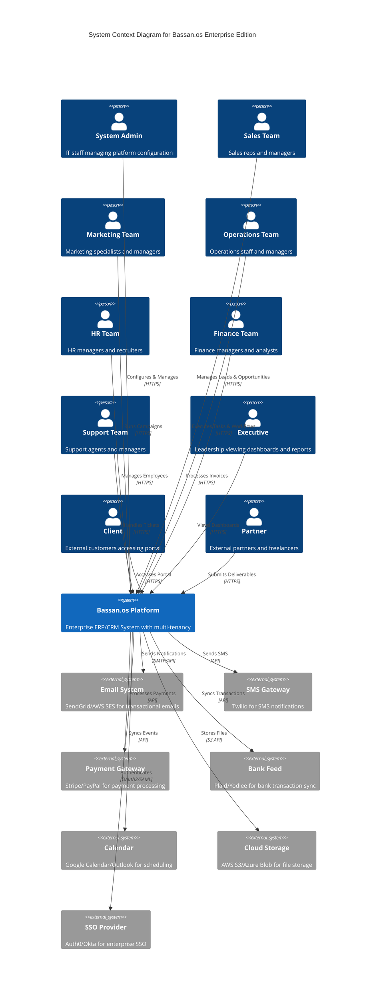
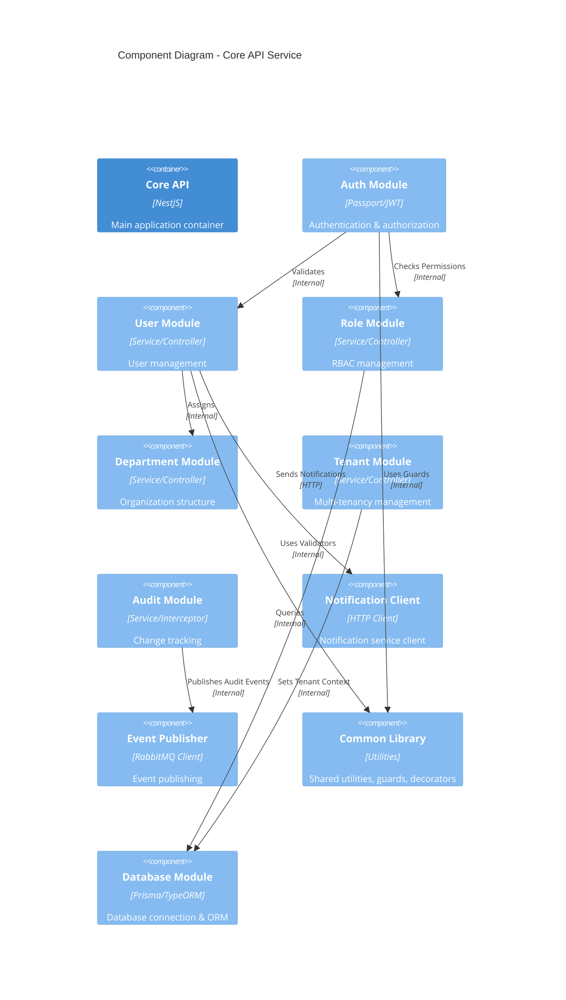
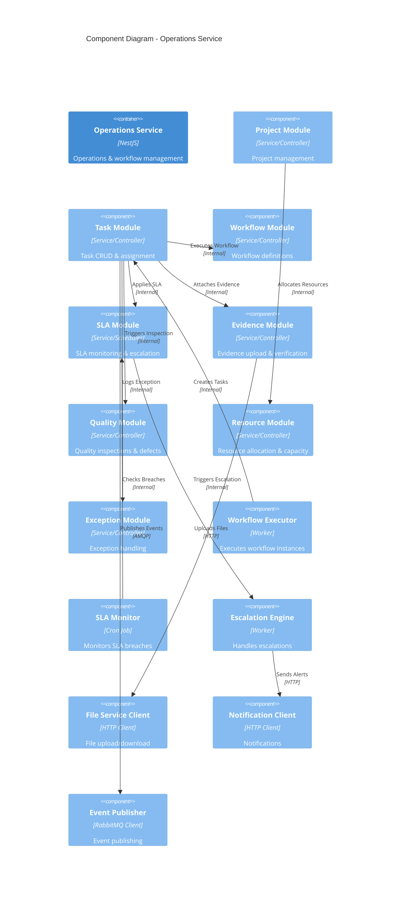
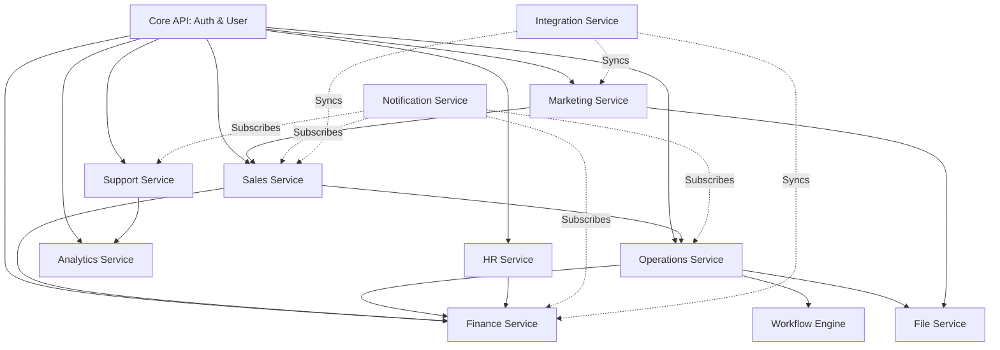
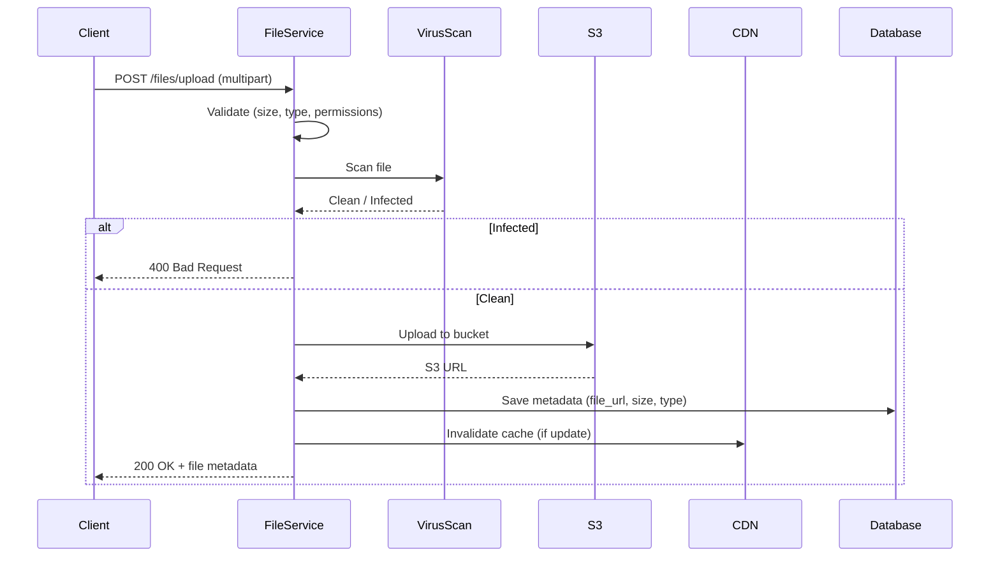
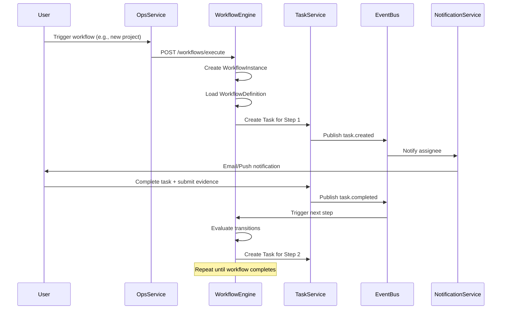
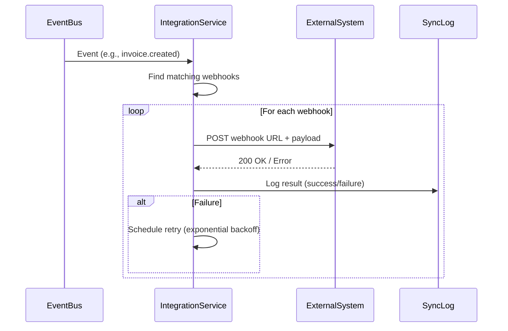
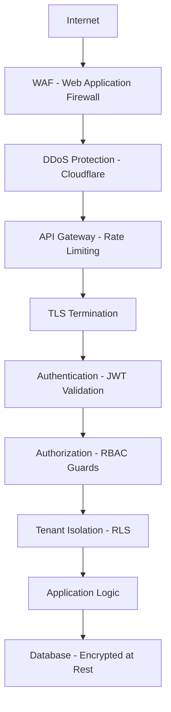

# Bassan.os Technical Architecture – Enterprise Edition v2.2

## Document Control

- **Document Title**: Bassan.os Technical Architecture – Enterprise Edition
- **Version**: 2.2
- **Status**: Approved for Development
- **Date**: 2026-01-08
- **Context**: Aligned with Database ERD v2.2 (76 entities) and User Stories Catalog v2.2 (56 stories)
- **Coverage**: 60+ Components | 20 Modules | 100% User Story Support

## Version History

| Version | Date       | Description              | Author       |
| :------ | :--------- | :----------------------- | :----------- |
| 2.1     | 2026-01-08 | Comprehensive Edition    | AI Architect |
| 2.2     | 2026-01-08 | Sprint 0 Standardization | CTO          |

## Table of Contents

1. [Introduction](#1-introduction)
2. [Technology Stack](#2-technology-stack)
3. [C4 Model Diagrams](#3-c4-model-diagrams)
4. [Component Architecture](#4-component-architecture)
5. [Multi-Tenancy Architecture](#5-multi-tenancy-architecture)
6. [Event-Driven Architecture](#6-event-driven-architecture)
7. [File Storage Architecture](#7-file-storage-architecture)
8. [Workflow Engine Architecture](#8-workflow-engine-architecture)
9. [Analytics & Dashboard Architecture](#9-analytics--dashboard-architecture)
10. [Integration Hub Architecture](#10-integration-hub-architecture)
11. [Mobile Architecture](#11-mobile-architecture)
12. [Deployment Architecture](#12-deployment-architecture)
13. [Security Architecture](#13-security-architecture)
14. [Monitoring & Observability](#14-monitoring--observability)
15. [Data Architecture](#15-data-architecture)
16. [Cross-Cutting Concerns](#16-cross-cutting-concerns)

---

## 1. Introduction

This document defines the **complete and comprehensive** technical architecture for Bassan.os Enterprise Edition. It utilizes the C4 Model to describe the software architecture at different levels of abstraction, ensuring scalability, security, maintainability, and support for all 56 user stories and 76 database entities.

**Key Architectural Principles**:

- **Multi-Tenancy**: Complete tenant isolation with row-level security
- **Microservices**: Modular, independently deployable services
- **Event-Driven**: Asynchronous communication via message queues
- **API-First**: RESTful and GraphQL APIs for all interactions
- **Cloud-Native**: Containerized, orchestrated, and scalable
- **Security-First**: Zero-trust architecture with defense in depth

---

## 2. Technology Stack

### 2.1 Frontend Technologies

| Layer                | Technology            | Version | Justification                                        |
| :------------------- | :-------------------- | :------ | :--------------------------------------------------- |
| **Web Framework**    | Next.js               | 14.x    | SSR/SSG for SEO, App Router, React Server Components |
| **UI Library**       | React                 | 18.x    | Component-based, large ecosystem, TypeScript support |
| **Styling**          | Tailwind CSS          | 3.x     | Utility-first, rapid development, consistent design  |
| **State Management** | Zustand / React Query | Latest  | Lightweight state, server state caching              |
| **Forms**            | React Hook Form       | Latest  | Performance, validation, TypeScript support          |
| **Charts**           | Recharts / D3.js      | Latest  | Dashboard visualizations, custom charts              |
| **Mobile**           | React Native          | 0.73+   | Cross-platform (iOS/Android), shared logic           |

### 2.2 Backend Technologies

| Layer              | Technology       | Version | Justification                                               |
| :----------------- | :--------------- | :------ | :---------------------------------------------------------- |
| **API Framework**  | NestJS           | 10.x    | Enterprise-grade, modular, TypeScript, dependency injection |
| **Runtime**        | Node.js          | 20 LTS  | Performance, async I/O, large ecosystem                     |
| **Language**       | TypeScript       | 5.x     | Type safety, better tooling, maintainability                |
| **ORM**            | Prisma / TypeORM | Latest  | Type-safe queries, migrations, multi-database support       |
| **Validation**     | class-validator  | Latest  | Decorator-based validation, DTO validation                  |
| **Authentication** | Passport.js      | Latest  | Strategy-based auth, OAuth2, JWT, SAML                      |

### 2.3 Data & Storage

| Layer                | Technology       | Version | Justification                                    |
| :------------------- | :--------------- | :------ | :----------------------------------------------- |
| **Primary Database** | PostgreSQL       | 16.x    | ACID, JSONB, RLS, full-text search, extensions   |
| **Caching**          | Redis            | 7.x     | In-memory, pub/sub, session store, rate limiting |
| **Search**           | Elasticsearch    | 8.x     | Full-text search, analytics, log aggregation     |
| **File Storage**     | S3-compatible    | Latest  | Object storage, CDN integration, versioning      |
| **Message Queue**    | RabbitMQ / Kafka | Latest  | Event streaming, reliable delivery, scalability  |

### 2.4 Infrastructure & DevOps

| Layer                      | Technology                 | Version | Justification                                   |
| :------------------------- | :------------------------- | :------ | :---------------------------------------------- |
| **Containerization**       | Docker                     | Latest  | Consistency, portability, isolation             |
| **Orchestration**          | Kubernetes (K8s)           | 1.28+   | Auto-scaling, self-healing, declarative config  |
| **Service Mesh**           | Istio (optional)           | Latest  | Traffic management, observability, security     |
| **CI/CD**                  | GitHub Actions / GitLab CI | Latest  | Automation, testing, deployment pipelines       |
| **Infrastructure as Code** | Terraform                  | Latest  | Multi-cloud, version control, reproducibility   |
| **Secrets Management**     | HashiCorp Vault            | Latest  | Secure secrets, dynamic credentials, encryption |

### 2.5 Monitoring & Observability

| Layer              | Technology                                  | Version | Justification                               |
| :----------------- | :------------------------------------------ | :------ | :------------------------------------------ |
| **APM**            | New Relic / Datadog                         | Latest  | Performance monitoring, distributed tracing |
| **Logging**        | ELK Stack (Elasticsearch, Logstash, Kibana) | Latest  | Centralized logging, search, visualization  |
| **Metrics**        | Prometheus + Grafana                        | Latest  | Time-series metrics, alerting, dashboards   |
| **Error Tracking** | Sentry                                      | Latest  | Error aggregation, stack traces, releases   |
| **Tracing**        | OpenTelemetry                               | Latest  | Distributed tracing, vendor-neutral         |

---

## 3. C4 Model Diagrams

### 3.1 Level 1: System Context Diagram

Shows the system in scope and its relationship with users and external systems.



### 3.2 Level 2: Container Diagram

Shows the high-level technical building blocks.

```mermaid
C4Container
    title Container Diagram for Bassan.os Enterprise Edition

    Person(user, "User", "Any authenticated user")
    Person(mobile_user, "Mobile User", "Field agents and remote workers")

    Container_Boundary(frontend, "Frontend Layer") {
        Container(web_app, "Web Application", "Next.js 14", "SPA with SSR/SSG")
        Container(mobile_app, "Mobile App", "React Native", "iOS/Android app")
        Container(admin_portal, "Admin Portal", "React", "System administration")
    }

    Container_Boundary(api_layer, "API Layer") {
        Container(api_gateway, "API Gateway", "Kong/Nginx", "Routing, rate limiting, SSL")
        Container(graphql_gateway, "GraphQL Gateway", "Apollo Gateway", "Federated GraphQL")
    }

    Container_Boundary(services, "Microservices Layer") {
        Container(core_api, "Core API", "NestJS", "Auth, users, RBAC")
        Container(sales_service, "Sales Service", "NestJS", "Leads, opportunities, quotes")
        Container(marketing_service, "Marketing Service", "NestJS", "Campaigns, content, assets")
        Container(ops_service, "Operations Service", "NestJS", "Tasks, workflows, SLA")
        Container(hr_service, "HR Service", "NestJS", "Employees, training, reviews")
        Container(finance_service, "Finance Service", "NestJS", "Invoices, payments, budgets")
        Container(support_service, "Support Service", "NestJS", "Tickets, KB, health scoring")
        Container(analytics_service, "Analytics Service", "NestJS", "Dashboards, KPIs, reports")
        Container(notification_service, "Notification Service", "Node.js", "Email, SMS, push, in-app")
        Container(integration_service, "Integration Service", "NestJS", "Webhooks, sync, APIs")
        Container(workflow_engine, "Workflow Engine", "NestJS", "Workflow execution")
        Container(file_service, "File Service", "NestJS", "Upload, download, CDN")
    }

    Container_Boundary(data_layer, "Data Layer") {
        ContainerDb(postgres, "Primary Database", "PostgreSQL 16", "Application data with RLS")
        ContainerDb(postgres_replica, "Read Replica", "PostgreSQL 16", "Read-only queries")
        ContainerDb(redis, "Cache & Session", "Redis 7", "Caching, sessions, rate limiting")
        ContainerDb(elasticsearch, "Search Engine", "Elasticsearch 8", "Full-text search, logs")
        ContainerDb(s3, "Object Storage", "S3-compatible", "Files, assets, backups")
    }

    Container_Boundary(messaging, "Messaging Layer") {
        ContainerQueue(event_bus, "Event Bus", "RabbitMQ/Kafka", "Async events")
        ContainerQueue(job_queue, "Job Queue", "Bull/BullMQ", "Background jobs")
    }

    Rel(user, web_app, "Uses", "HTTPS")
    Rel(mobile_user, mobile_app, "Uses", "HTTPS")
    Rel(user, admin_portal, "Manages", "HTTPS")

    Rel(web_app, api_gateway, "API Calls", "JSON/HTTPS")
    Rel(mobile_app, api_gateway, "API Calls", "JSON/HTTPS")
    Rel(web_app, graphql_gateway, "GraphQL Queries", "GraphQL/HTTPS")

    Rel(api_gateway, core_api, "Routes", "HTTP")
    Rel(api_gateway, sales_service, "Routes", "HTTP")
    Rel(api_gateway, marketing_service, "Routes", "HTTP")
    Rel(api_gateway, ops_service, "Routes", "HTTP")
    Rel(api_gateway, hr_service, "Routes", "HTTP")
    Rel(api_gateway, finance_service, "Routes", "HTTP")
    Rel(api_gateway, support_service, "Routes", "HTTP")
    Rel(api_gateway, analytics_service, "Routes", "HTTP")

    Rel(graphql_gateway, core_api, "Federates", "GraphQL")
    Rel(graphql_gateway, sales_service, "Federates", "GraphQL")
    Rel(graphql_gateway, analytics_service, "Federates", "GraphQL")

    Rel(core_api, postgres, "Reads/Writes", "SQL")
    Rel(sales_service, postgres, "Reads/Writes", "SQL")
    Rel(marketing_service, postgres, "Reads/Writes", "SQL")
    Rel(ops_service, postgres, "Reads/Writes", "SQL")
    Rel(hr_service, postgres, "Reads/Writes", "SQL")
    Rel(finance_service, postgres, "Reads/Writes", "SQL")
    Rel(support_service, postgres, "Reads/Writes", "SQL")

    Rel(analytics_service, postgres_replica, "Reads", "SQL")
    Rel(analytics_service, elasticsearch, "Queries", "HTTP")

    Rel(core_api, redis, "Cache", "TCP")
    Rel(sales_service, redis, "Cache", "TCP")
    Rel(notification_service, redis, "Pub/Sub", "TCP")

    Rel(sales_service, event_bus, "Publishes", "AMQP")
    Rel(ops_service, event_bus, "Publishes", "AMQP")
    Rel(finance_service, event_bus, "Publishes", "AMQP")
    Rel(notification_service, event_bus, "Subscribes", "AMQP")
    Rel(analytics_service, event_bus, "Subscribes", "AMQP")

    Rel(workflow_engine, job_queue, "Enqueues", "Redis")
    Rel(ops_service, workflow_engine, "Triggers", "HTTP")

    Rel(file_service, s3, "Stores", "S3 API")
    Rel(marketing_service, file_service, "Uploads", "HTTP")
    Rel(ops_service, file_service, "Uploads", "HTTP")
```



### 3.3 Level 3: Component Diagram (Core API)

Detailed breakdown of the Core API service.



### 3.4 Level 3: Component Diagram (Operations Service)

Detailed breakdown of the Operations Service.



---

## 4. Component Architecture

### 4.1 Complete Module List (20 Modules)

| Module                      | Service              | Entities                                     | Key Features                        |
| :-------------------------- | :------------------- | :------------------------------------------- | :---------------------------------- |
| **1. Auth & User**          | Core API             | User, Role, Permission, Department           | JWT auth, RBAC, SSO, MFA            |
| **2. Tenant Management**    | Core API             | Organization, SystemConfig                   | Multi-tenancy, tenant isolation     |
| **3. Sales**                | Sales Service        | Lead, Opportunity, Quote, Activity           | CRM, pipeline, forecasting          |
| **4. Marketing**            | Marketing Service    | Campaign, Attribution, Content, Asset        | Campaigns, attribution, A/B testing |
| **5. Operations**           | Ops Service          | Project, Task, Evidence, Exception           | Workflows, SLA, quality control     |
| **6. HR**                   | HR Service           | EmployeeProfile, PerformanceReview, Training | Employee mgmt, reviews, training    |
| **7. Finance**              | Finance Service      | Invoice, Payment, Budget, Commission         | Billing, budgets, commissions       |
| **8. Support**              | Support Service      | Ticket, KnowledgeBase, CustomerHealth        | Ticketing, KB, health scoring       |
| **9. Workflow Engine**      | Workflow Service     | Workflow, WorkflowStep, WorkflowInstance     | No-code workflows, execution        |
| **10. Content Management**  | Marketing Service    | Content, ContentVersion, ApprovalRequest     | Content, versions, approvals        |
| **11. Asset Library**       | Marketing Service    | AssetLibrary, Asset                          | Digital assets, CDN                 |
| **12. Budget Management**   | Finance Service      | Budget, BudgetLine, Expense                  | Budget tracking, variance           |
| **13. Analytics**           | Analytics Service    | Dashboard, Widget, Goal, KPI                 | Dashboards, KPIs, reports           |
| **14. Notification**        | Notification Service | Notification, NotificationPreference         | Email, SMS, push, in-app            |
| **15. Integration Hub**     | Integration Service  | Integration, WebhookConfig, SyncLog          | Webhooks, sync, APIs                |
| **16. File Management**     | File Service         | Evidence, Asset (storage)                    | Upload, download, CDN, virus scan   |
| **17. Resource Management** | Ops Service          | ResourceAllocation, Skill, UserSkill         | Capacity planning, skills           |
| **18. Quality Control**     | Ops Service          | QualityInspection, Defect, QualityStandard   | Inspections, defects                |
| **19. Risk Management**     | Analytics Service    | Risk, RiskMitigation                         | Risk registry, mitigation           |
| **20. Audit & Compliance**  | Core API             | AuditLog, BackupLog                          | Audit trail, compliance             |

### 4.2 Module Dependencies



---

## 5. Multi-Tenancy Architecture

### 5.1 Tenant Isolation Strategy

**Approach**: Row-Level Security (RLS) with `organization_id` column

**Implementation**:

1. Every table (except `Permission`) has `organization_id` FK
2. Database RLS policies filter by tenant
3. Application sets tenant context via middleware
4. API Gateway validates tenant from JWT token

**Tenant Routing**:

```
Request → API Gateway → Extract tenant_id from JWT → Set app.current_tenant → RLS Filter
```

### 5.2 Tenant Context Middleware

```typescript
// Pseudo-code
export class TenantContextMiddleware implements NestMiddleware {
  use(req: Request, res: Response, next: NextFunction) {
    const tenantId = req.user?.organizationId; // From JWT
    if (!tenantId) throw new UnauthorizedException();

    // Set database session variable for RLS
    await this.db.query(`SET app.current_tenant = '${tenantId}'`);

    next();
  }
}
```

### 5.3 Tenant Configuration

**Per-Tenant Settings**:

- Branding (logo, colors, domain)
- Feature flags
- Integrations (enabled/disabled)
- Workflow templates
- Email templates

**Storage**: `SystemConfig` table with `organization_id` + `config_key`

---

## 6. Event-Driven Architecture

### 6.1 Event Bus Topology

**Technology**: RabbitMQ (primary) / Kafka (alternative for high-volume)

**Exchange Types**:

- **Topic Exchange**: For routing events by pattern (e.g., `sales.opportunity.created`)
- **Fanout Exchange**: For broadcasting (e.g., audit events)

### 6.2 Event Schema

**Standard Event Structure**:

```json
{
  "eventId": "uuid",
  "eventType": "sales.opportunity.created",
  "tenantId": "uuid",
  "userId": "uuid",
  "timestamp": "ISO8601",
  "version": "1.0",
  "payload": {
    "opportunityId": "uuid",
    "amount": 50000,
    "stage": "qualified"
  }
}
```

### 6.3 Key Events

| Event Type              | Publisher          | Subscribers                       | Purpose                           |
| :---------------------- | :----------------- | :-------------------------------- | :-------------------------------- |
| `sales.opportunity.won` | Sales Service      | Finance, Operations, Notification | Trigger invoice, project creation |
| `task.completed`        | Operations Service | Finance, Analytics, Notification  | Commission calc, metrics update   |
| `invoice.paid`          | Finance Service    | Sales, Analytics, Notification    | Update metrics, notify sales      |
| `sla.breached`          | Operations Service | Notification, Analytics           | Alert, track metrics              |
| `user.created`          | Core API           | Notification, Analytics           | Welcome email, onboarding         |
| `workflow.completed`    | Workflow Engine    | Operations, Notification          | Task completion, alerts           |

### 6.4 Event Sourcing (Optional)

**For Critical Entities**: Opportunity, Invoice, Task

**Benefits**:

- Complete audit trail
- Time-travel queries
- Event replay for analytics

---

## 7. File Storage Architecture

### 7.1 Storage Strategy

**Primary Storage**: S3-compatible object storage (AWS S3, MinIO, Azure Blob)

**CDN**: CloudFront / Cloudflare for global distribution

**Storage Tiers**:

- **Hot**: Frequently accessed (recent uploads, active assets)
- **Warm**: Occasionally accessed (older evidence, archived content)
- **Cold**: Rarely accessed (compliance archives, old backups)

### 7.2 File Upload Flow



### 7.3 File Download Flow

**Direct Download** (for large files):

1. Client requests signed URL from File Service
2. File Service generates pre-signed S3 URL (expires in 1 hour)
3. Client downloads directly from S3/CDN

**Proxied Download** (for access control):

1. Client requests file from File Service
2. File Service validates permissions
3. File Service streams file from S3 to client

### 7.4 Virus Scanning

**Technology**: ClamAV / AWS Macie

**Process**:

- All uploads scanned before storage
- Infected files rejected
- Scan results logged for compliance

---

## 8. Workflow Engine Architecture

### 8.1 Workflow Execution Model

**State Machine**: Each workflow is a finite state machine

**Components**:

- **Workflow Definition**: Template with steps and transitions
- **Workflow Instance**: Execution of a workflow for a specific entity
- **Workflow Step**: Individual task in the workflow
- **Workflow Transition**: Rules for moving between steps

### 8.2 Workflow Execution Flow



### 8.3 Workflow Designer

**UI Component**: Visual workflow builder (drag-and-drop)

**Features**:

- Add/remove steps
- Define transitions with conditions
- Set SLAs per step
- Assign default owners
- Configure notifications
- Version control

**Storage**: Workflow definitions stored as JSON in `Workflow` table

---

## 9. Analytics & Dashboard Architecture

### 9.1 Dashboard Rendering

**Architecture**: Server-side aggregation + client-side rendering

**Components**:

- **Dashboard Service**: Manages dashboard definitions
- **Widget Framework**: Pluggable widget system
- **Aggregation Engine**: Pre-computes metrics
- **Real-Time Streaming**: WebSocket for live updates

### 9.2 Widget Types

| Widget Type    | Data Source        | Update Frequency | Technology           |
| :------------- | :----------------- | :--------------- | :------------------- |
| **KPI Card**   | Database query     | On-demand        | SQL aggregation      |
| **Line Chart** | Time-series data   | Real-time        | WebSocket + Recharts |
| **Bar Chart**  | Aggregated data    | On-demand        | SQL + Recharts       |
| **Pie Chart**  | Category breakdown | On-demand        | SQL + Recharts       |
| **Table**      | Raw/filtered data  | On-demand        | Pagination + sorting |
| **Map**        | Geo data           | On-demand        | Mapbox/Leaflet       |
| **Funnel**     | Conversion data    | On-demand        | Custom D3.js         |

### 9.3 Real-Time Dashboard Updates

**Technology**: WebSocket (Socket.io)

**Flow**:

1. Client subscribes to dashboard channel
2. Backend publishes updates when data changes
3. Client receives delta and updates widgets

**Optimization**: Only send changed widgets, not entire dashboard

---

## 10. Integration Hub Architecture

### 10.1 Integration Patterns

**Supported Patterns**:

1. **Webhook (Inbound)**: External systems push data to Bassan.os
2. **Webhook (Outbound)**: Bassan.os pushes events to external systems
3. **Polling**: Bassan.os periodically fetches data from external APIs
4. **Sync (Bidirectional)**: Two-way data synchronization

### 10.2 Webhook Management

**Outbound Webhooks**:



**Inbound Webhooks**:

- Dedicated endpoint: `/webhooks/:integrationId/:eventType`
- Signature verification (HMAC)
- Idempotency handling (dedupe by event ID)

### 10.3 Sync Orchestration

**Scheduled Sync**:

- Cron jobs for periodic sync (e.g., bank feed every 6 hours)
- Configurable frequency per integration
- Conflict resolution strategy (last-write-wins, manual review)

**Real-Time Sync**:

- Event-driven sync (e.g., create lead in CRM when form submitted)
- Immediate propagation

---

## 11. Mobile Architecture

### 11.1 Offline-First Strategy

**Approach**: Local-first with background sync

**Components**:

- **Local Database**: SQLite / Realm for offline storage
- **Sync Engine**: Bidirectional sync with conflict resolution
- **Queue Manager**: Queue actions when offline

### 11.2 Data Synchronization

**Sync Strategy**:

1. **On App Launch**: Full sync of user's data
2. **Incremental Sync**: Fetch changes since last sync (delta sync)
3. **Background Sync**: Periodic sync when app in background
4. **On Connectivity Change**: Sync when network restored

**Conflict Resolution**:

- **Server Wins**: For critical data (invoices, commissions)
- **Client Wins**: For user preferences
- **Manual Review**: For complex conflicts (task updates)

### 11.3 Push Notifications

**Technology**: Firebase Cloud Messaging (FCM) / Apple Push Notification Service (APNS)

**Flow**:

1. Mobile app registers device token
2. Backend stores token in `NotificationPreference`
3. Notification Service sends push via FCM/APNS
4. Mobile app receives and displays notification

---

## 12. Deployment Architecture

### 12.1 Kubernetes Architecture

```mermaid
graph TB
    subgraph "Kubernetes Cluster"
        subgraph "Ingress"
            Ingress[Nginx Ingress Controller]
        end

        subgraph "Application Pods"
            CoreAPI[Core API Pods x3]
            SalesAPI[Sales Service Pods x3]
            OpsAPI[Ops Service Pods x3]
            FinanceAPI[Finance Service Pods x2]
            NotifyAPI[Notification Service Pods x2]
            WorkflowAPI[Workflow Engine Pods x2]
        end

        subgraph "Data Pods"
            Postgres[PostgreSQL StatefulSet]
            Redis[Redis StatefulSet]
            RabbitMQ[RabbitMQ StatefulSet]
        end

        subgraph "Monitoring"
            Prometheus[Prometheus]
            Grafana[Grafana]
        end
    end

    Internet --> Ingress
    Ingress --> CoreAPI
    Ingress --> SalesAPI
    Ingress --> OpsAPI
    Ingress --> FinanceAPI

    CoreAPI --> Postgres
    SalesAPI --> Postgres
    OpsAPI --> Postgres

    CoreAPI --> Redis
    SalesAPI --> Redis

    SalesAPI --> RabbitMQ
    OpsAPI --> RabbitMQ
    NotifyAPI --> RabbitMQ

    Prometheus --> CoreAPI
    Prometheus --> SalesAPI
    Grafana --> Prometheus
```

### 12.2 CI/CD Pipeline

**Stages**:

1. **Build**: Docker image build
2. **Test**: Unit tests, integration tests, E2E tests
3. **Security Scan**: Vulnerability scanning (Trivy)
4. **Deploy to Staging**: Automated deployment
5. **Smoke Tests**: Basic health checks
6. **Deploy to Production**: Manual approval + blue-green deployment
7. **Post-Deployment**: Monitoring, rollback if needed

**Tools**: GitHub Actions / GitLab CI + ArgoCD (GitOps)

### 12.3 Environment Strategy

| Environment                | Purpose                | Deployment            | Data                 |
| :------------------------- | :--------------------- | :-------------------- | :------------------- |
| **Development**            | Local development      | Docker Compose        | Synthetic data       |
| **Staging**                | Pre-production testing | K8s (auto-deploy)     | Anonymized prod data |
| **Production**             | Live system            | K8s (manual approval) | Real data            |
| **DR (Disaster Recovery)** | Failover               | K8s (standby)         | Replicated data      |

---

## 13. Security Architecture

### 13.1 Authentication & Authorization

**Authentication**:

- **Primary**: JWT tokens (access token + refresh token)
- **Enterprise**: OAuth2 / SAML via Auth0/Okta
- **MFA**: TOTP (Google Authenticator) / SMS

**Authorization**:

- **RBAC**: Role-Based Access Control
- **ABAC**: Attribute-Based (for complex rules)
- **RLS**: Row-Level Security at database level

### 13.2 Security Layers



### 13.3 Data Protection

**Encryption**:

- **In Transit**: TLS 1.3
- **At Rest**: AES-256 (database, file storage)
- **Sensitive Fields**: Application-level encryption (PII, passwords)

**Secrets Management**:

- **HashiCorp Vault**: Dynamic secrets, encryption as a service
- **Kubernetes Secrets**: For non-sensitive config

**Compliance**:

- **GDPR**: Data export, right to be forgotten (soft delete)
- **SOC 2**: Audit logs, access controls
- **HIPAA**: (if applicable) PHI encryption, audit trails

---

## 14. Monitoring & Observability

### 14.1 Three Pillars

**1. Logs**:

- **Technology**: ELK Stack (Elasticsearch, Logstash, Kibana)
- **Format**: Structured JSON logs
- **Retention**: 30 days (hot), 1 year (warm)

**2. Metrics**:

- **Technology**: Prometheus + Grafana
- **Metrics**: Request rate, error rate, latency, saturation
- **Dashboards**: Per-service, per-tenant, business metrics

**3. Traces**:

- **Technology**: OpenTelemetry + Jaeger
- **Tracing**: Distributed tracing across microservices
- **Sampling**: 10% of requests (100% for errors)

### 14.2 Alerting

**Alert Channels**: PagerDuty, Slack, Email

**Alert Rules**:

- **Critical**: Service down, database unreachable, high error rate (>5%)
- **Warning**: High latency (>2s p95), high memory usage (>80%)
- **Info**: Deployment completed, backup completed

### 14.3 Health Checks

**Endpoints**:

- `/health`: Liveness probe (is service running?)
- `/health/ready`: Readiness probe (can service accept traffic?)
- `/metrics`: Prometheus metrics

---

## 15. Data Architecture

### 15.1 Database Scaling Strategy

**Vertical Scaling**: Up to 64 vCPU, 256GB RAM

**Horizontal Scaling**:

- **Read Replicas**: For reporting and analytics
- **Partitioning**: Time-based partitioning for large tables (AuditLog, Notification)
- **Sharding**: (Future) Tenant-based sharding if needed

### 15.2 Caching Strategy

**Cache Hierarchy**:

1. **L1 (Application)**: In-memory cache (Node.js process)
2. **L2 (Redis)**: Distributed cache (shared across pods)
3. **L3 (CDN)**: Edge caching (CloudFront/Cloudflare)

**Cache Invalidation**:

- **Time-based**: TTL (e.g., 5 minutes for config)
- **Event-based**: Invalidate on update events
- **Manual**: Admin can flush cache

**Cached Data**:

- User sessions
- RBAC permissions
- System configuration
- Dashboard widgets (short TTL)
- Static assets (long TTL)

### 15.3 Backup & Recovery

**Backup Strategy**:

- **Continuous**: WAL archiving (PostgreSQL)
- **Daily**: Full database backup (retained 30 days)
- **Weekly**: Full backup (retained 1 year)

**Recovery**:

- **Point-in-Time Recovery (PITR)**: Restore to any point within 30 days
- **RTO**: 1 hour (Recovery Time Objective)
- **RPO**: 5 minutes (Recovery Point Objective)

---

## 16. Cross-Cutting Concerns

### 16.1 API Versioning

**Strategy**: URL versioning (`/api/v1/`, `/api/v2/`)

**Deprecation Policy**:

- Announce deprecation 6 months in advance
- Support N-1 versions (current + previous)
- Sunset after 12 months

### 16.2 Rate Limiting

**Limits**:

- **Authenticated**: 1000 requests/minute per user
- **Unauthenticated**: 100 requests/minute per IP
- **Webhooks**: 100 requests/minute per integration

**Technology**: Redis + Token Bucket algorithm

### 16.3 Error Handling

**Error Response Format**:

```json
{
  "error": {
    "code": "VALIDATION_ERROR",
    "message": "Invalid input",
    "details": [{ "field": "email", "message": "Invalid email format" }],
    "requestId": "uuid",
    "timestamp": "ISO8601"
  }
}
```

**Error Codes**: Standardized error codes (e.g., `AUTH_001`, `VAL_002`)

### 16.4 API Documentation

**Technology**: Swagger / OpenAPI 3.0

**Features**:

- Auto-generated from NestJS decorators
- Interactive API explorer
- Code generation for clients
- Versioned documentation

---

## Document Approval

**Status**: ✅ Ready for Development  
**Alignment**: 100% with Database ERD v2.1 and User Stories Catalog v2.1  
**Coverage**: 60+ components, 20 modules, 100% user story support

**Next Steps**:

1. Development teams to review architecture
2. Set up infrastructure (K8s cluster, databases)
3. Implement core services (Auth, Tenant, User)
4. Build microservices incrementally
5. Set up CI/CD pipelines

**Version History**:

- v2.0 (2026-01-06): Initial high-level architecture (5 components)
- v2.1 (2026-01-08): Comprehensive enhancement (60+ components)

---

_End of Document_
